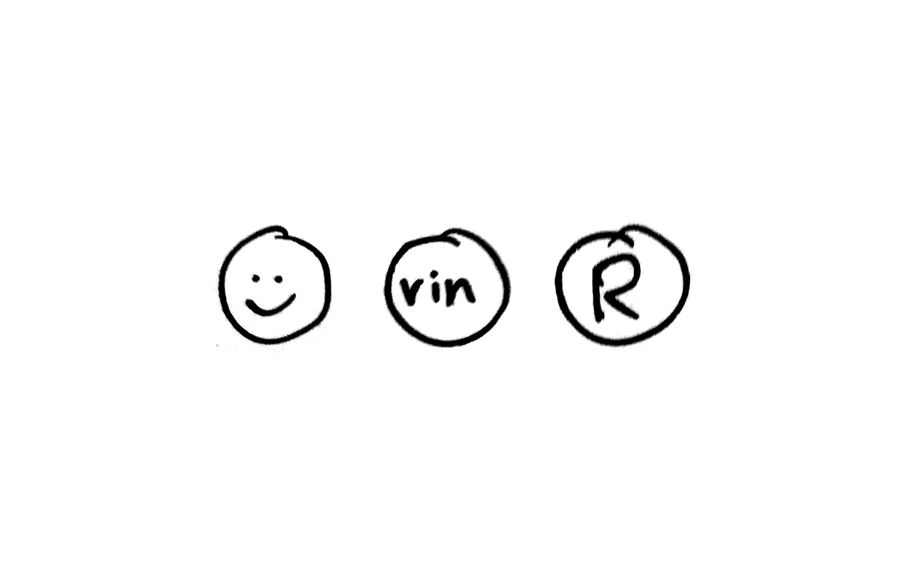

## Weiterentwicklung

- @Todo: keine Großbuchstaben
- Unterscheidung Nutzer nicht dpa / Nutzer dpa-Mitarbeiter
- Nutzer im Zusammenspiel mit [Team](../../Team)
- Wenn kein Bild da ist, wie wird Nutzer unterscheidbar dargestellt werden (Hintergrundfarbe, generierte Patterns, ...)

## Beschreibung

Der Nutzer ist ein Medien- oder Kommunikationsprofi mit einer [dpa-ID](../connect-design-kit/glossar.html#dpa·id), der ein oder mehrere dpa-Tools oder andere über die dpa-ID erreichbare Tools nutzt.

Der Nutzer verfügt über eine __dpa-ID__, d.h. eine Email und ein Passwort mit der er sich einloggen kann.  Der Nutzer
ist eventuell Teil eines Teams. Der Nutzer hat ein Bild oder eine Repräsentanz mit Kürzel. Der Nutzer hat einen Namen.

Der Nutzer ist in unterschiedlichen Rollen auf dem Marktplatz. Er ist als Person identifizierbar, damit er mit anderen identifizierbaren Personen, also Nutzern in Beziehung treten kann (Kommunizieren, Teilen, Kollaborieren) oder er kann mit Werteinheiten in Beziehung treten (kaufen, zum Kauf anbieten, Planen)

## Skizze

## Begründung für die Gestaltung

### Runde Form

Vorbild sind Twitter und Material Design. Insbesondere in Abgrenzung zu der eckigen Form von [Apps](/Werteinheiten/App).

## OOUX-Draft

- *Nutzer*
- Bild
- Kürzel
- Name
- Rolle/Titel
- Organisation
- Gehört zu einem oder mehreren Teams
- E-Mail / Passwort