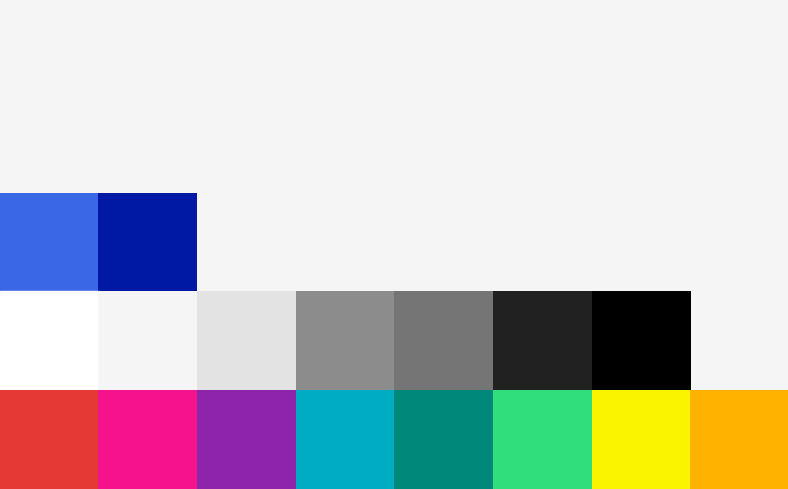

# Farben

## Beschreibung
Unsere Farben leuchten, denn die Produkte sollen Spaß machen.

Die Primärfarbe ist blau, daneben werden hauptsächlich Grautöne eingesetzt. Für vielfältige Gestaltungsmöglichkeiten können Farben aus unserem Regenbogen genutzt werden. Erfolgs- und Fehlerhinweise haben eigene Farben.

In der folgenden Übersicht sind die Farben definiert.

