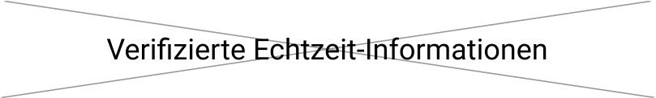
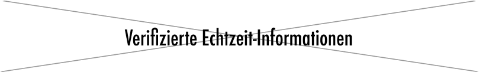
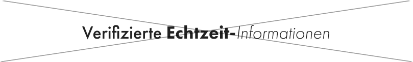
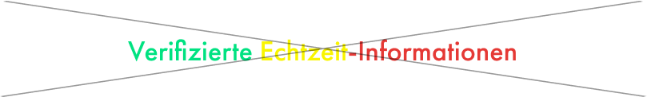

# Futura PT

Futura PT ist die Hausschrift der dpa. Sie kann über Adobe Fonts aktiviert werden: <https://fonts.adobe.com/fonts/futura-pt>

__Schriftschnitte:__ Book, Medium und Demi 
Weitere Schriftschnitte sollten in der Regel nicht eingesetzt werden. Versalsatz sollte nur für Dachzeilen und Auszeichnungen genutzt werden.

__Anwendungsbeispiele:__ Überschriften größer als 16px, Dachzeilen, Zitate, Initialien, Navigationsüberschriften

__Hinweis:__ Falls ein Dokument mit dieser Schrift verschickt wird, bitte vorab als PDF konvertieren.

# Inter

Inter wird für die meisten Texte eingesetzt. Sie kann hier bezogen werden: https://rsms.me/inter/ 

__Schriftschnitte:__ Regular, Medium und Semibold (nicht italic)
Weitere Schriftschnitte sollten in der Regel nicht eingesetzt werden.

__Anwendungsbeispiele:__ Fließtext, Buttontext, Links, Überschriften bis zu 16px, PowerPoint-Präsentationen, Geschäftsunterlagen, die via Microsoft Office erstellt werden.

__Hinweis:__ Falls ein Dokument mit dieser Schrift verschickt wird, bitte vorab als PDF konvertieren.

# Fallback-Schrift: Arial

Ist der Einsatz von Futura PT oder Inter nicht möglich, so ist die Schrift Arial als Fallback einzusetzen. Damit sind insbesondere Geschäftskorrespondenz, Excel-Tabellen und alle internen Schriftstücke gemeint. Grundsätzlich gilt ein unkomplizierter und pragmatischer Ansatz. Die beiden Hauptschriften Futura PT und Inter werden in erster Linie für Websites, Broschüren, Merchandising-Artikel und alles andere Offizielle eingesetzt.

# Beispiele falsche Nutzung

Es sollen keine anderen Schriften oder Schriftschnitte oder gemischte Schriftschnitte eingesetzt werden. Außerdem soll der Text gut lesbar sein und nicht zu viele unterschiedliche Farben haben.

