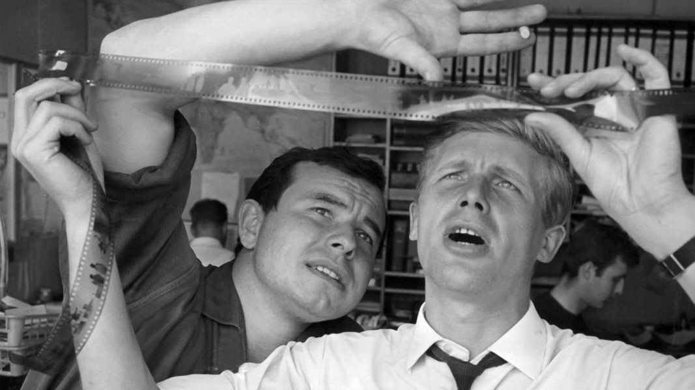

Fotos und Videos dürfen keine starken Filter, überzogene Effekte enthalten, da die dpa Deutsche Presse-Agentur GmbH für Transparenz und Qualität steht.

Die Tonalität ist modern, hell und seriös. Die Farben sind natürlich oder schwarz-weiß. Der Kontrast ist unverändert, bzw. bildet die Realität ab.

Menschen stehen im Vordergrund und sollen authentisch wirken. Überzogene Gesten wie häufig in Stockfotografie zu sehen, gilt es zu vermeiden. Bilder sollten möglichst dynamisch wirken und Spannung erzeugen. Nach Möglichkeit sollten Bilder der picture alliance mit nachrichtlichen Charakter genutzt werden. Stockfotos Dritter sollten nicht genutzt werden.

# Beispiele

### dpa Impressionen

### Nachrichtliche Bilder und Symbolbilder

### Archivbilder

# Einfärbung
Bilder können schwarz-weiß eingefärbt werden. Für Marketingzwecke können in Ausnahmen Bilder auch farbig in dpa Grüntönen oder für dpa ID im dpa ID Blau überlagert werden, um mehrere Bilder zusammengehörig erscheinen zu lassen. Es wird empfohlen mit Grafikern von dpa Marketing zu arbeiten.

