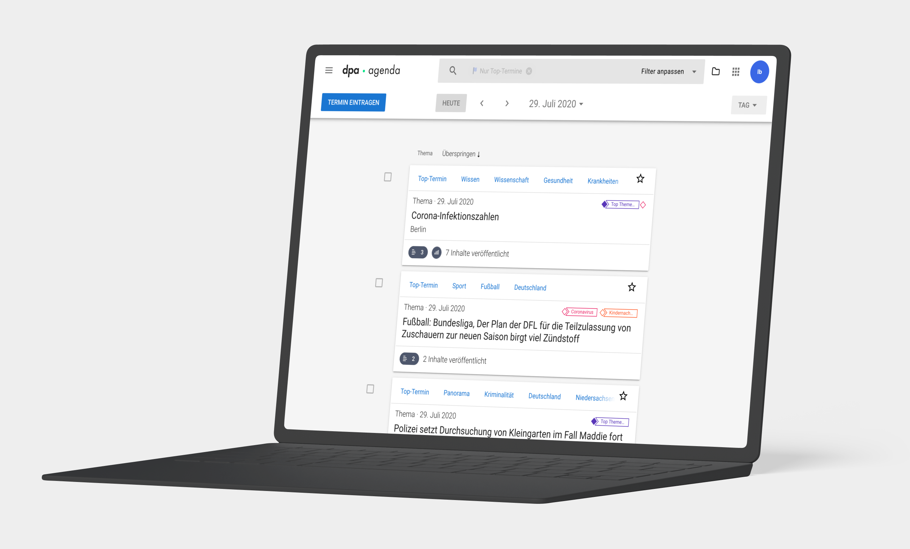
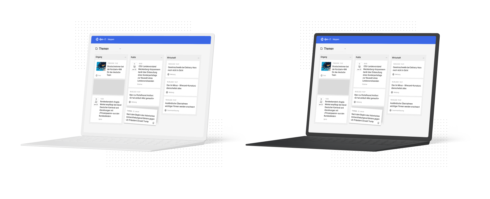
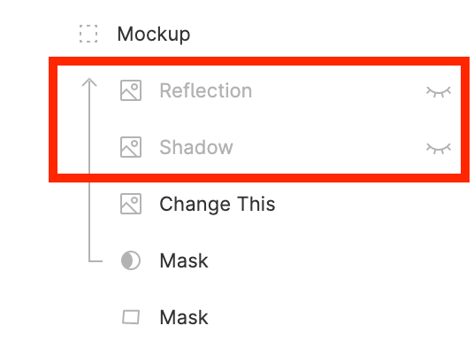
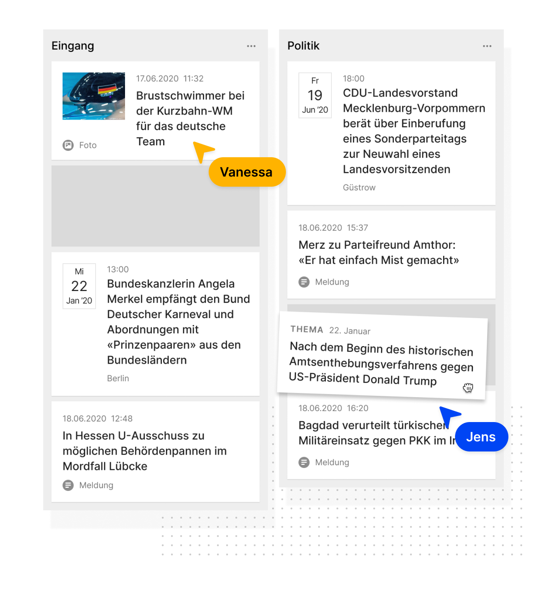

# Allgemeine Richtlinien
Der Einsatz von Gestaltungselementen ist mit dpa Marketing abzustimmen.

# Punkteraster
Punkteraster können als ergänzendes Element unter Flächen, Fotos und Störern eingesetzt werden. Die erstellte Fläche ist frei in Höhe und Breite und sollte sich harmonisch einfügen.

[Vorlage herunterladen](/api/v1/tree/Grundlagen/Gestaltungselemente/Punkteraster.zip)

# Marker
Headlines oder Textauszeichnungen können mit der Marker-Linie hervorgehoben werden. 
Diese sind in der Regel in dpa Leuchtgrün, können für dpa-ID Apps aber auch in dpa-ID Leuchtblau eingefärbt genutzt werden.

[Vorlage herunterladen](/api/v1/tree/Grundlagen/Gestaltungselemente/Marker.zip)

# Schatten
## Harter Effektschatten

Zur visuellen Unterstützung von Bildern oder Störern wird ein harter Effektschatten mit folgenden Werten eingesetzt.

__Design:__ X: 8 Y: 20 Blur: 2 Spread: 0 Farbe: schwarz 3%

__CSS:__ box-shadow: 8px 20px 2px rgba(0, 0, 0, 0.03);

## Sanfte Schatten

Neben dem harten Effektschatten können die drei sanften Schatten vom Design Kit genutzt werden.

# Mockups
Für die Darstellung von Apps eignen sich Mockups, welche spannender sind, als einfache Screenshots. Mockups sollten zudem mit Gestaltungselementen ergänzt werden, um visuell noch ansprechender auszusehen.

## Geräte-Mockups
Empfohlen wird der Einsatz vom Presentation Kit, welches über <https://www.presentationkit.pro/> verfügbar ist. Über <https://www.ls.graphics/unlimited-access> bekommt man über das jährliche Abo uneingeschränkten Zugriff für aktuelle Mockups sowie weitere Mockupsets. Alternativ kann <https://placeit.net> genutzt werden.

Mockups vom Presentation Kit sind für Adobe Photoshop, Figma und Sketch verfügbar.

- für Photoshop benötigt man keine Plugins
- für Sketch benötigt man [http://magicsketch.io/mirror/](Magic Mirror) oder [https://github.com/MengTo/Angle-Sketch-Plugin](Angle)
- für Figma benötigt man [https://www.figma.com/community/plugin/817043359134136295/Mockup](Mockup)

### Anpassungen
- “Clay”-Variante nutzen. 
- Geräte (Device) Farbe auf einen Farbton der dpa Farben ändern, besonders geeignet sind hierbei __Grau 900__ oder __Grau 200__.

Bei Apps, welche im Play Store oder App Store verfügbar sind, kann man auch echte Geräte ohne den “Clay-Effekt” nutzen, falls dies besser zum Gesamtbild passt.

Die Ebenen über dem “Change This” Screen sollten ausgeblendet werden. Somit verhindert man Lichtreflexionen und andere Farbtöne als im Design.

## Interaktions-Mockups
Wenn bestimmte Features einer App gezeigt werden, so können Interaktionen auch stilisiert dargestellt werden.

Dabei sollte es sich um eine reduzierte Darstellung handeln, Videos von Interaktionsabläufen sind ebenfalls möglich.

