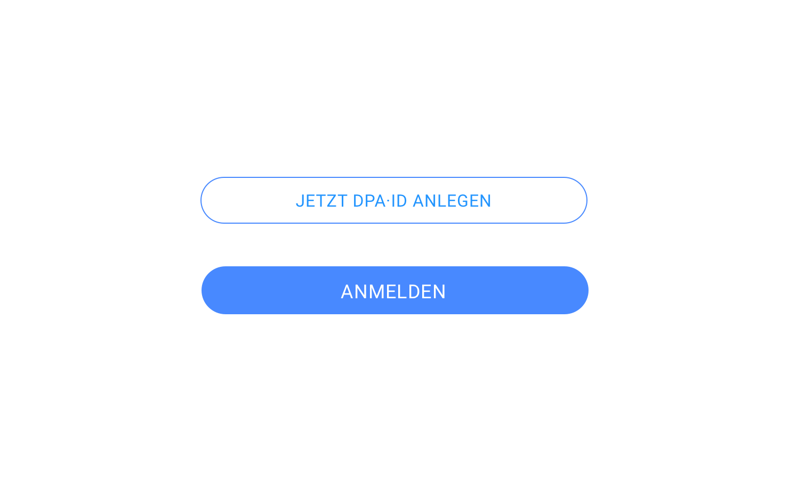

# Button

::: tip Iterationsrichtungen
1. Icon Button
:::

## Code-Beispiele

::: warning
Die Code-Beispiele basieren auf einer ersten exemplarischen Umsetzung für bootstrap und sind noch nicht visuell abgenommen.
:::

### Default

<iframe style="border: 0" src="https://dpa-connect.github.io/bootstrap-theme/btn-default.html"></iframe>

### Primary

<iframe style="border: 0" src="https://dpa-connect.github.io/bootstrap-theme/btn-primary.html"></iframe>

