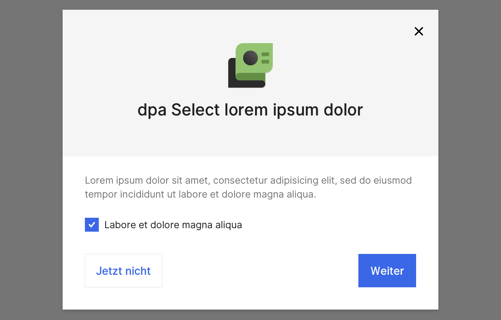
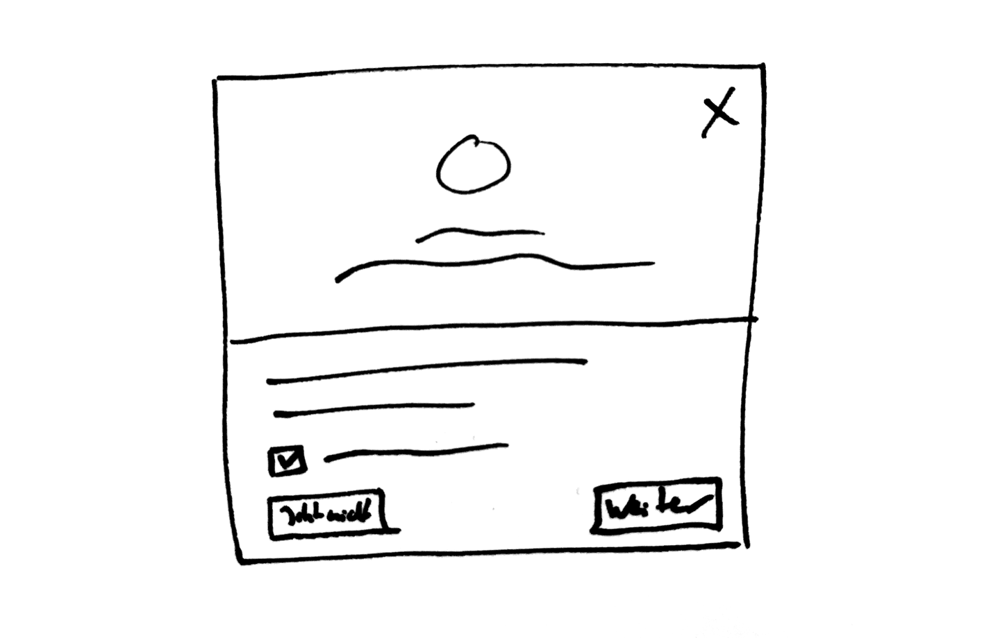

# Dialog

## Beschreibung
Dialoge dienen als Hinweis für Funktionen und andere Informationen. Sie können Teaserflächen, Bilder und Text sowie interaktive Elemente wie Checkboxen und Buttons enthalten.

## Skizze

