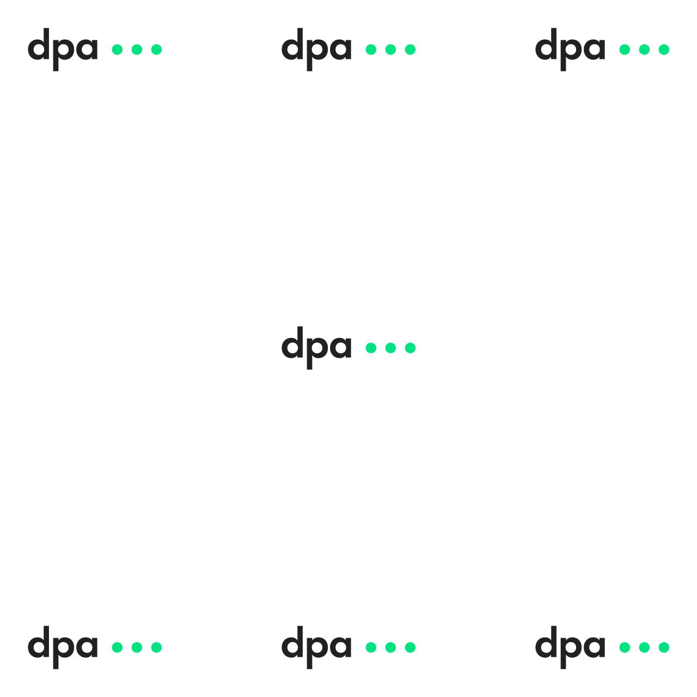
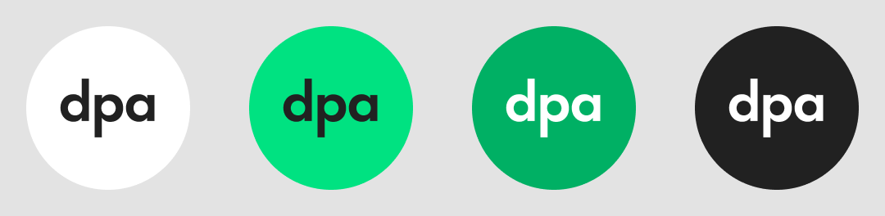

- Das Logo sollte immer mit Schutzraum eingesetzt werden, nur intern und in Ausnahmen ist eine Nutzung ohne Schutzraum gestattet
- Es sollte immer das farbige Logo eingesetzt werden, nur in Ausnahmen die einfarbigen Varianten
- Andere Farben oder Grüntöne sind nicht erlaubt

# Logokoffer
[Logokoffer herunterladen](dpa_Logokoffer.zip)

# Logopositionen
Das Logo kann ausgehend von der Layoutfläche oben links, oben mittig, oben rechts, zentriert / mittig, unten links, unten mittig und unten rechts platziert werden.

Andere Positionen sind nur in Ausnahmen gestattet.

# Mindestgröße

Der Schriftzug dpa soll immer erkennbar sein. Das Logo (mit Schutzraum) soll daher 

- digital nicht kleiner als eine Höhe von 24px haben
- im Druck nicht kleiner als eine Höhe von 20mm haben

# Mindestabstände

Das Logo soll immer mit ausreichend Abstand zu den Rändern platziert werden, wie in die Logodateien mit Schutzraum festgelegt. Größere Abstände sind selbstverständlich möglich.

# Logo auf Bildern und Videos
Nur wenn der Untergrund geeignet ist und das Logo gut lesbar ist, darf das Logo auf Bildern und Videos platziert werden. Wenn das Logo auf einem Bild dargestellt werden soll, welches nicht bearbeitet wird, so ist ergänzend ein weißer oder schwarzer Hintergrund notwendig.

## Beispiele

## Beispiele falsche Nutzung
Das Logo soll gut erkennbar sein und in der Farbe nicht verändert werden.
  <Dont caption="Don’t do this either, it is definitely not good!" strikethrough="true">
</Dont>

## Social Media

[Vorlage herunterladen](dpa_Logo_SocialMedia.zip)

