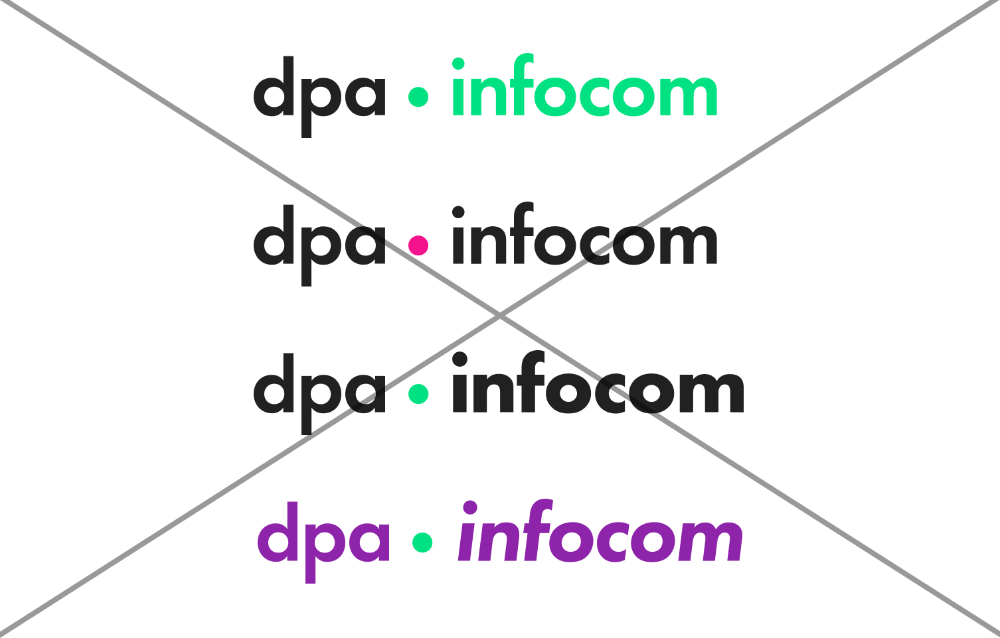

Logos der Tochterunternehmen werden nach dem Punkt in Futura PT Demi gesetzt.

Andere Anpassungen jeglicher Art (anderer Farbton, Schriftart, etc.) sind nicht gestattet bzw. in Ausnahmen mit dpa Marketing abzustimmen.

# Logokoffer
- [picture alliance](/api/v1/tree/Logos/dpa-Tochterunternehmen/picturealliance.zip)
- [dpa infocom](/api/v1/tree/Logos/dpa-Tochterunternehmen/dpa_infocom.zip)
- [dpa infografik](/api/v1/tree/Logos/dpa-Tochterunternehmen/dpa_infografik.zip)
- [dpa international](/api/v1/tree/Logos/dpa-Tochterunternehmen/dpa_international.zip)
- [dpa digital services](/api/v1/tree/Logos/dpa-Tochterunternehmen/dpa_digitalservices.zip)
- [dpa it](/api/v1/tree/Logos/dpa-Tochterunternehmen/dpa_it.zip)
- [dpa audio & video service](/api/v1/tree/Logos/dpa-Tochterunternehmen/dpa_audiovideoservice.zip)
- [dpa zentralbild](/api/v1/tree/Logos/dpa-Tochterunternehmen/dpa_zentralbild.zip)

# Beispiele falsche Nutzung

Es sollen keine anderen Schriften oder Schriftschnitte eingesetzt werden. Der Punkt hat dpa Leuchtgrün als Farbe, andere Elemente dürfen nicht eingefärbt werden.

