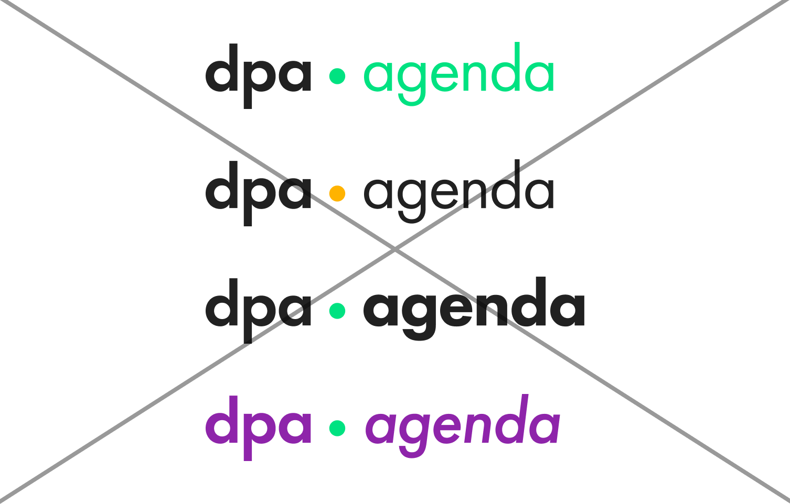

Produktlogos werden nach dem Punkt in Futura PT Book gesetzt und können beim dpa Marketing angefragt werden.

# Beispiele falsche Nutzung

Es sollen keine anderen Schriften oder Schriftschnitte eingesetzt werden. Der Punkt hat dpa Leuchtgrün als Farbe, andere Elemente dürfen nicht eingefärbt werden.

