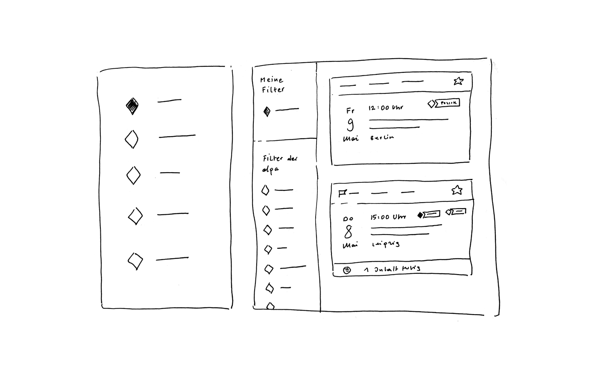
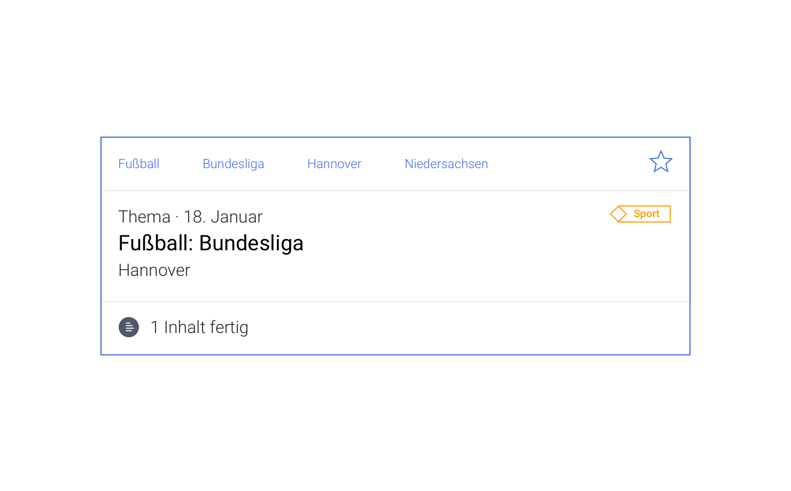
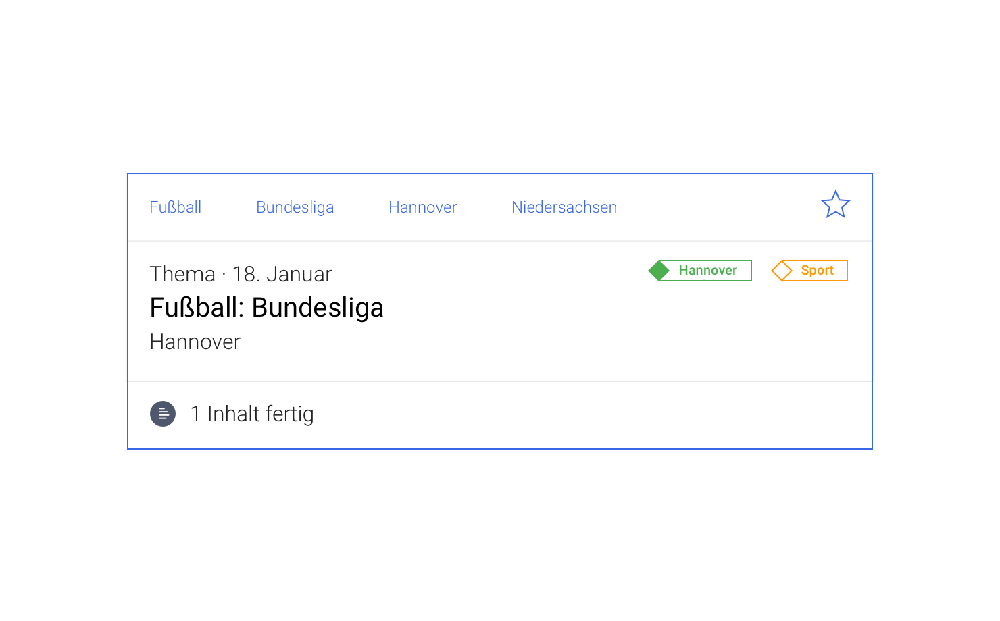
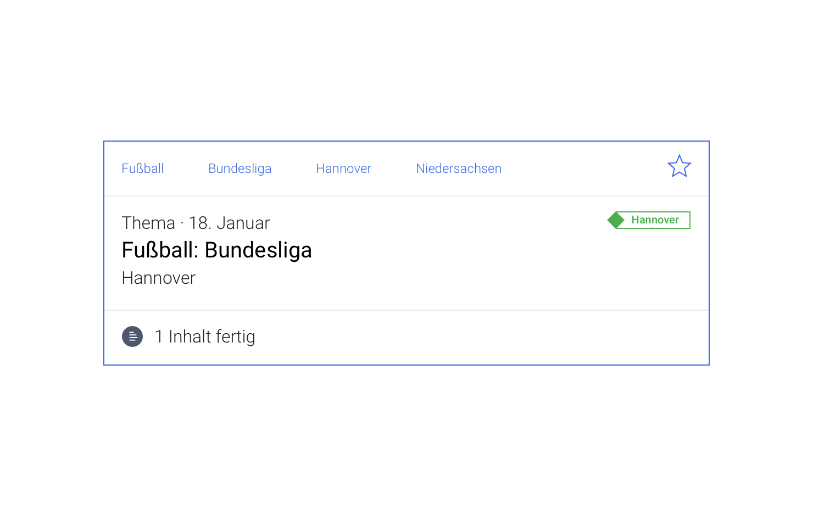

# Skizze

# Weiterentwicklung

1. Gefüllte 'Fahne' für eigene Filter
2. WKW Filter für Farbblind und Sehbeeinsträchtigte unterscheidbar gestalten?
3. Idee: Andere Formen als Raute als Unterscheidungsmerkmal zulassen?

# Kontext

<cdk-preview title="A">

</cdk-preview>
<cdk-preview title="B">

</cdk-preview>
<cdk-preview title="C">

</cdk-preview>
