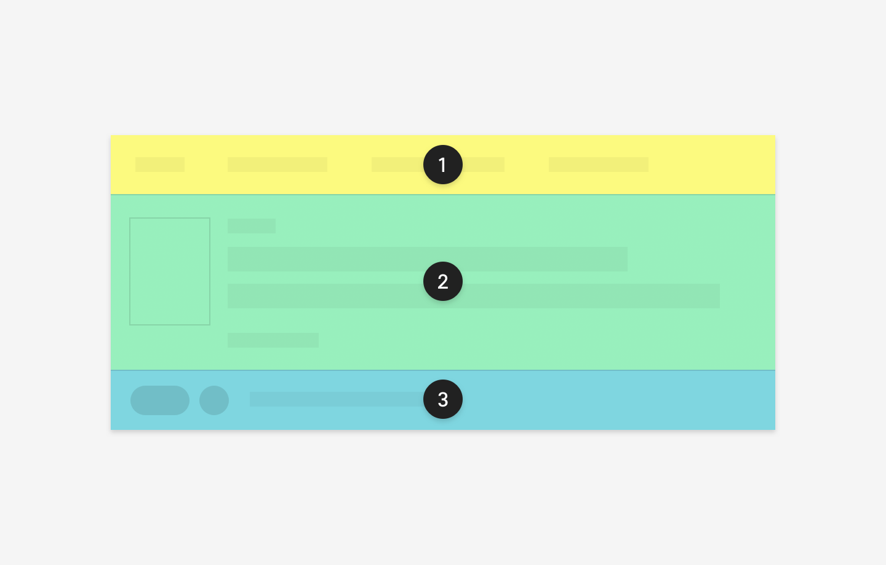

# Beschreibung
Mit Hilfe der von dpa oder Fremdanbietern gelieferten Hinweise zu Terminen und Themen sind Nutzer in der Lage zu planen, was sie in Zukunft publizieren oder bearbeiten wollen.

Zu einem Hinweis gehören verschiede Werteinheiten, die eine visuelle Gestaltung und eine definierte Anordnung haben. In unterschiedlichen Kontexten können unterschiedliche viele Werteinheiten  eines Hinweises angezeigt werden.

Autor, kann eine Person, eine Team oder eine Organisation sein - wer gibt den Hinweis auf den Termin oder das Thema

- Klassifizierung - wie ordnet dpa den Termin oder das Thema ein?
- Termin / Thema - der Termin oder das Thema
- Berichterstattung (intended/fulfilled) - wird dpa berichten und in welchem Ausmaß?

# Spezifikation

<Playground src="specification.json">
  
</Playground>

- **1** [Klassifizierung](../../Werteinheiten/Klassifizierung)  
- **2** [Termin](../../Werteinheiten/Termin) oder [Thema](../../Werteinheiten/Thema)
- **3** [Berichterstattung](../../Werteinheiten/Berichterstattung)  

# Zukünftige Weiterentwicklung
* Hinweise mit Werteinheiten von fremden Dritten
* Autor / Team / Organisation als eigene Werteinheit

# Ausprägung
* Liste
* Detailansicht
* Vorschau-View
* Monatsansicht

# Kontext
* in agenda
* im Hub / App

# OOUX Draft
**Hinweis**
Autor / Team / Organisation
Klassifizierung
Termin / Thema
Berichterstattung
