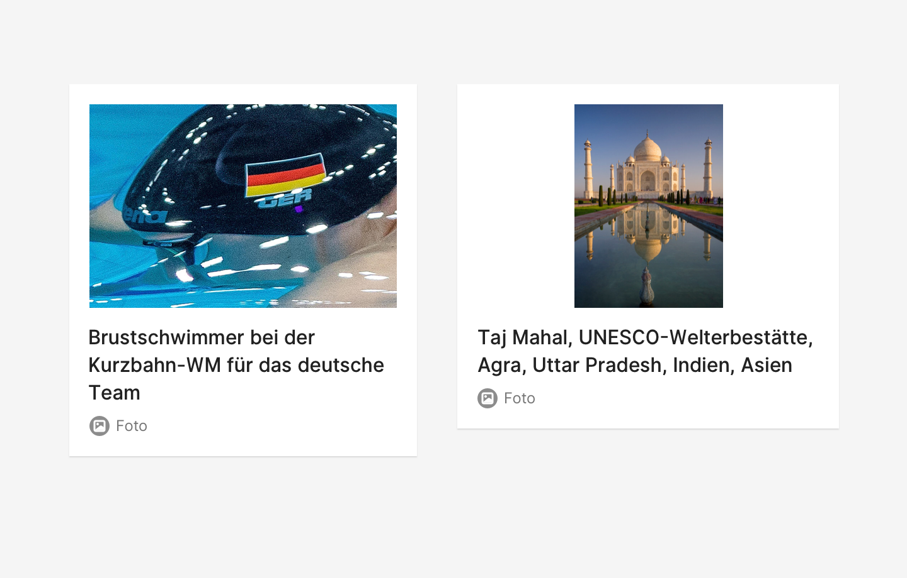
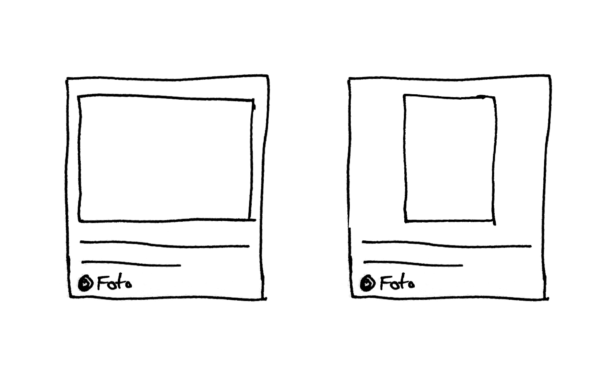

## Beschreibung
Foto ist ein Inhalt und damit eine journalistische Werteinheiten der dpa oder anderer Anbieter, es ist Bestandteil eines Nachrichtenstücks. Ein Foto wird zur Publikation oder zu Informationszwecken angeboten. 

## Iterationsrichtung
* Foto als Versprechen (geplant) und Foto manifest (gesendet) visuell unterschieden

## Ausprägung

* ☑️ Minimalform
* ☑️ Hochformat, Querformat
* ☑️ gesendet (manifestiert.)
* ☑️ Detailview
* ☑️ als Teil eine Fotostrecke
* im Zustand des Versprechens (Planung)
* Liste Vorschau und Ticker

## Kontext
* in Agenda am **Termin** / **Thema**
* in der Schalttafel
* in dpa-news
* in Select
* im Hub / App
* E-Mail

## OOUX-Draft
**Bild**
* Bild
* Überschrift 63 Zeichen
* — Detail
* Bildgröße
* Bildunterschrift incl Name: Datum, Ort, Land, Fotograf: Urheber / Quelle
* Ressort
* Stichworte
* — Verwendungswunsch
* Rechte
* Genre
* Texthinweis

