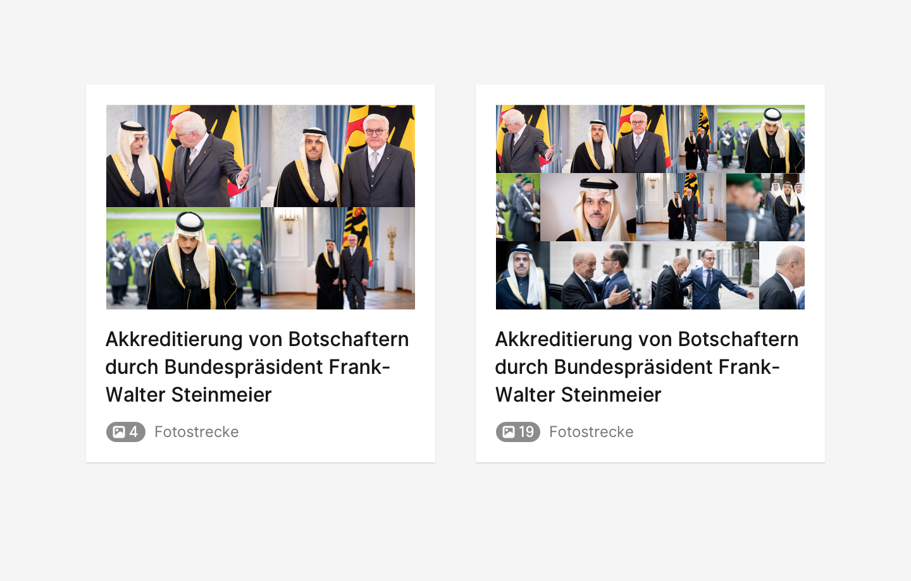
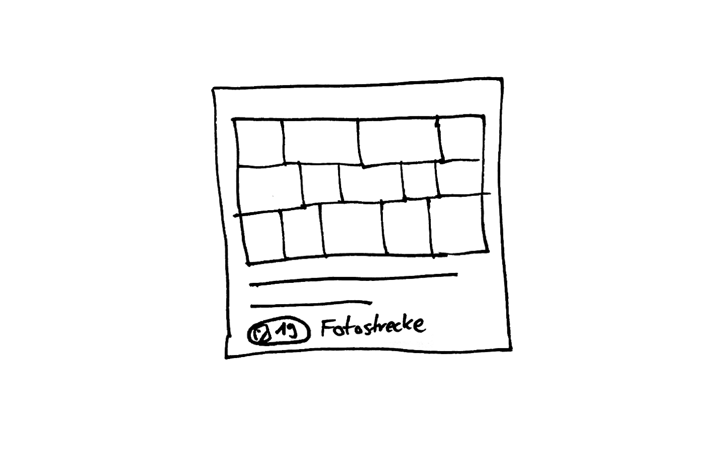

## Beschreibung
Die Fotostrecke ist eine Sammlung von Werteinheiten des Medienformats Foto, die zu Terminen und Themen publiziert werden. Eine Fotostrecke kann aus beliebig vielen Fotos bestehen.

## Iterationsrichtung
* Fotostrecke als Versprechen (geplant) und Fotostrecke manifest (gesendet) visuell unterschieden

## Ausprägung

* ☑️ Minimal
* ☑️ Detail
* ☑️ kompakt 

## Kontext
* in Agenda am **Termin** / **Thema**
* im Hub / App
* E-Mail
