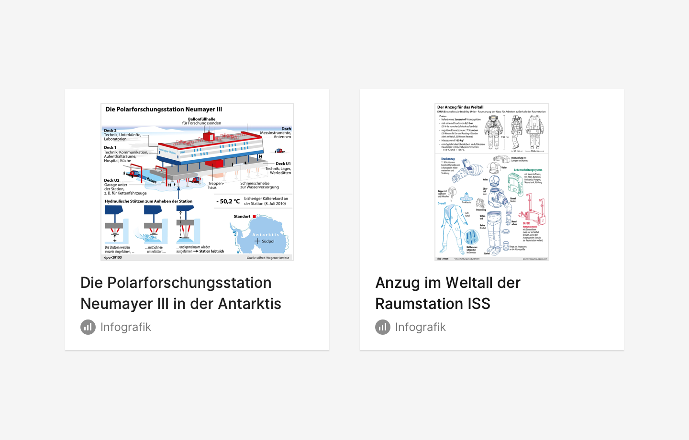
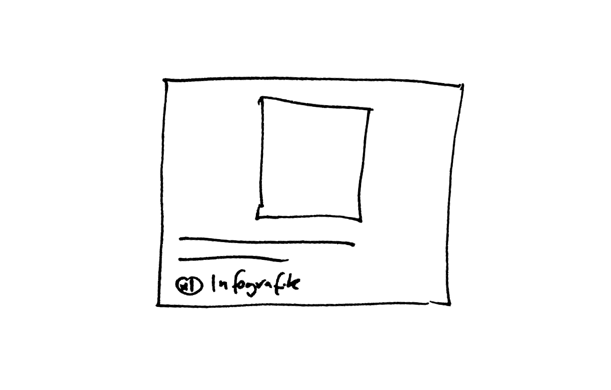

## Beschreibung
Grafik  ist ein Inhalt und damit eine journalistische Werteinheiten der dpa oder anderer Anbieter, sie ist Bestandteil eines Nachrichtenstücks. Eine Grafik wird zur Publikation oder zu Informationszwecken angeboten. 

## Iterationsrichtung
* Grafik als Versprechen (geplant) und Foto manifest (gesendet) visuell unterschieden
* Beschnitt unterschiedlich großer Grafiken

## Ausprägung
*  im Zustand des Versprechens (Planung), gesendet (manifestiert.)
* als Teil eine Grafik-Strecke
* Minimalform
* Hochformat, Querformat, Scrollable
* in Liste 
* als Detailansicht

## Kontext
* in Agenda am **Termin** / **Thema**
* in der Schalttafel
* in dpa-news
* in Select
* im Hub / Hub app
* in E-Mail

## OOUX-Draft
**Grafik**
* Grafik
* Überschrift
* Datum
* Ressort
* Erklärtext
* Art  (Diagramm, Karte, Schaubild, …
* Grafik Nr
* Format / Dimensionen und Ausrichtung
* Aktualisiert / Version
* Redakteur
* Grafiker

