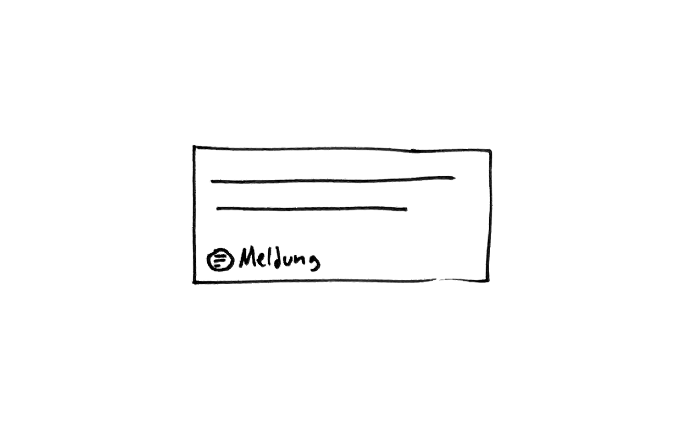

## Beschreibung
Text ist ein Inhalt und damit eine journalistische Werteinheiten der dpa oder anderer Anbieter, er ist Bestandteil eines Nachrichtenstücks. Ein Text wird zur Publikation oder zu Informationszwecken angeboten. 
Text liegt in unterschiedlichen Genres vor und hat eine dem jeweiligen Genre entsprechende Gestalt.

Die wichtigsten Genres sind:
* Korr-Bericht
* Hintergrund
* Meldung
* Zusammenfassung
* Frage & Antwort
* Vorschau

## Iterationsrichtung
* Text als Versprechen (geplant) und Text manifest (gesendet) visuell und strukturell unterscheiden
* genrespezifische Darstellung
* Auszeichnung der Textstruktur (Leadabsatz etc.)
* Verknüpfung mit Personen, Organisationen, Zitaten, Geografika

## Ausprägung
*  im Zustand des Versprechens (Planung), gesendet (manifestiert.)
* in Minimalform
* innerhalb eines Nachrichtenstücks kombiniert mit anderen Werteinheiten 
* Notification
* in Liste
* Detailansicht

## Kontext
* in Agenda am *Termin* / *Thema*
* in der Schalttafel
* in dpa-news
* in Select
* in E-Mail

## OOUX-Draft
*Material*
Titel
Materialtyp
Datum
Uhrzeit
Genre
Format Details, Länge
Quelle
Wire
Text / Bild / Vorschau
Notizblock
