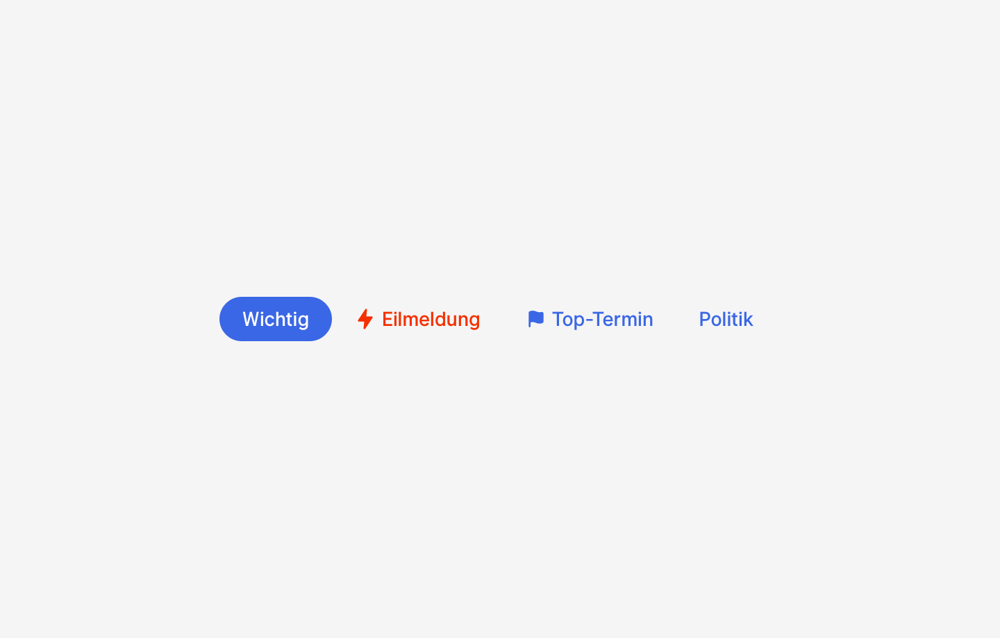
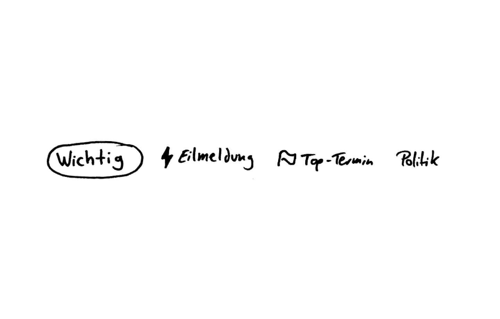
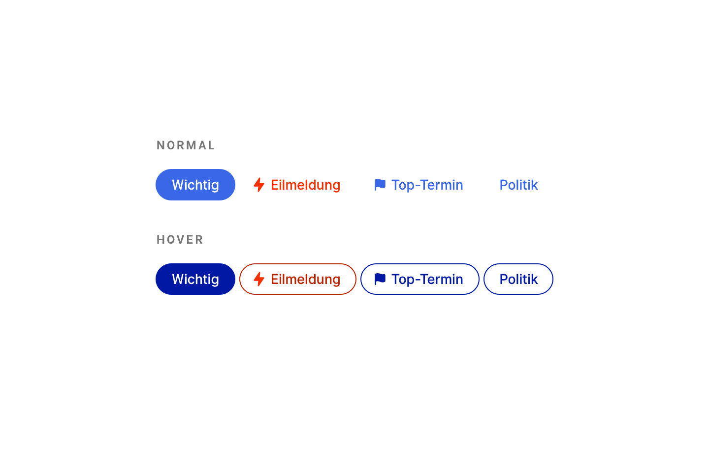
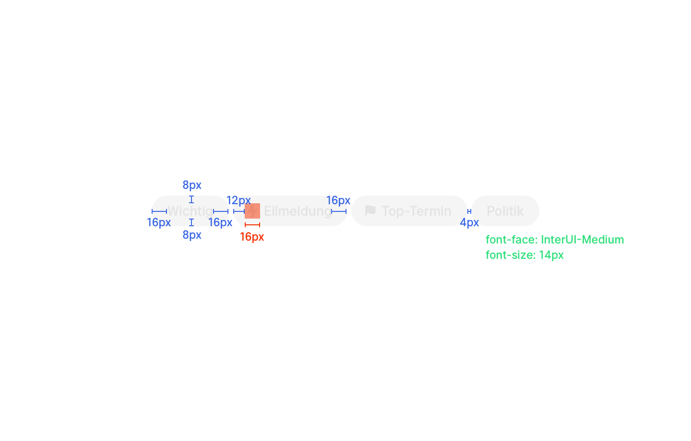

## Beschreibung
Ein Tag ist ein Begriff, der einen Aspekt von Klassifizierung der dpa oder des Nutzers ausdrückt. Er hat eine visuelle Gestaltung; eigene Tags und die Tags der dpa sind  unterscheidbar

Die Tags der dpa ermöglichen den Nutzerinnen eine schnelle Einordnung der Inhalte. Eigene Tags ermöglichen es den Nutzern sich Inhalte zu eigen zu machen und ihnen damit eine eigene Einordnungshilfe hinzuzufügen.

BSP: Dies ist eine *Eil*meldung aus dem Bereich *Politik*, es geht um einen *Prozess* in *Bayern* der nur *regional* relevant ist und der mir als Nutzerin sehr *Wichtig* ist.

Außerdem können sich Nutzerinnen mithilfe der Tags durch die Inhalte navigieren, da die Tags auch als Filter fungieren. (Kontextuelle Navigation)

## Zukünftige Weiterentwicklung
* Nicht nur Text in den Tags, sondern auch Icons
* Erstellung eigener Tags

## Ausprägung
* Tag für Stichwort
* Tag für Eilmeldungen
* Tag für Top-Thema
* Nutzer-Tag

## Kontext
* innerhalb der Klassifizierung auf Karte in Agenda und select
* Detailview

## OOUX Draft
*Team*
Tag
Name
