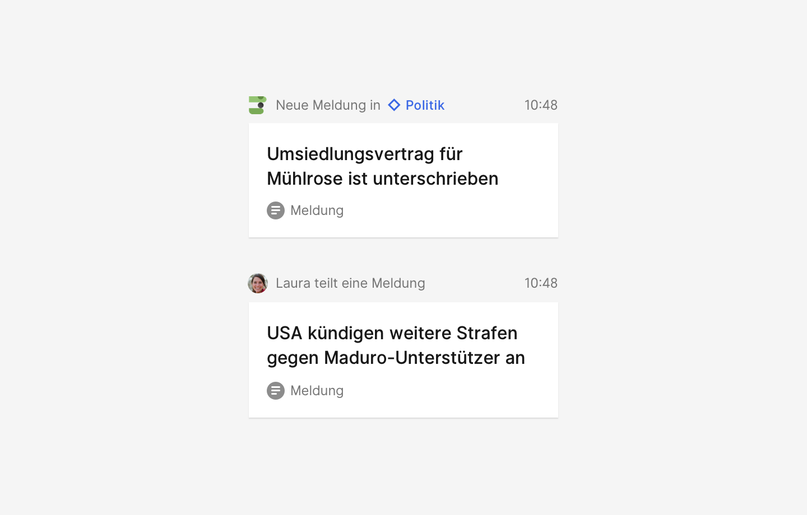

## Beschreibung

Aktivitäten sind Aktionen (Publizieren, Teilen, Einladen) eines Akteurs (Person, Team, Organisation) eine Werteinheit betreffend (Text, Bild, Kommentar, Termin, Filter) in einem bestimmten Kontext (App, Filter).

Wir gehen davon aus, dass

- Aktivitäten für bestimmte Nutzer relevant sind und dewegen von einem Nutzer beobachtet werden, z.B. ein Nutzer der Anwendung select beobachtet das Publizieren von Texten der dpa-Redaktion
- Um dieses Beobachten zu ermöglichen, lösen Aktivitäten (zur Zeit immer, in Zukunft nicht immer) Mitteilungen aus
- Die Mitteilungen erfolgen als E-Mail oder Push-Mitteilung in der dpa ID App
- Ein Historie der Aktivitäten ist in der dpa ID App sichtbar
- Aktivitäten beziehen sich immer auf eine Werteinheit (Object)
- Für Aktivitäten gibt es ein definiertes Set an Aktionen (Activity)
- Aktivitäten werden für einen Nutzer dann sichtbar, wenn der Kontext (Context) relevant ist, er zum Beispiel einen Filter erstellt hat
- Aktivitäten werden auch dann für Nutzer sichtbar, wenn eine andere Person (Actor) direkt mit dem Nutzer interagiert, zum Beispiel einen Text (Object) teilt (Activity)

