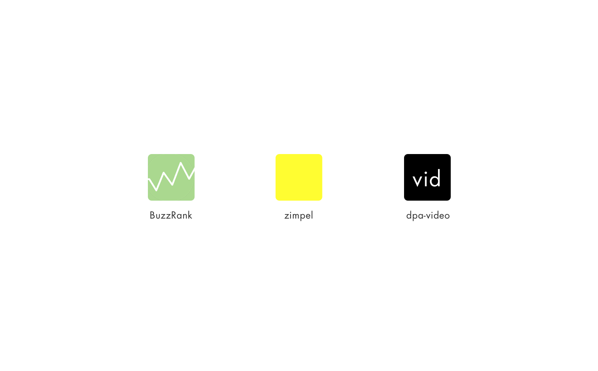
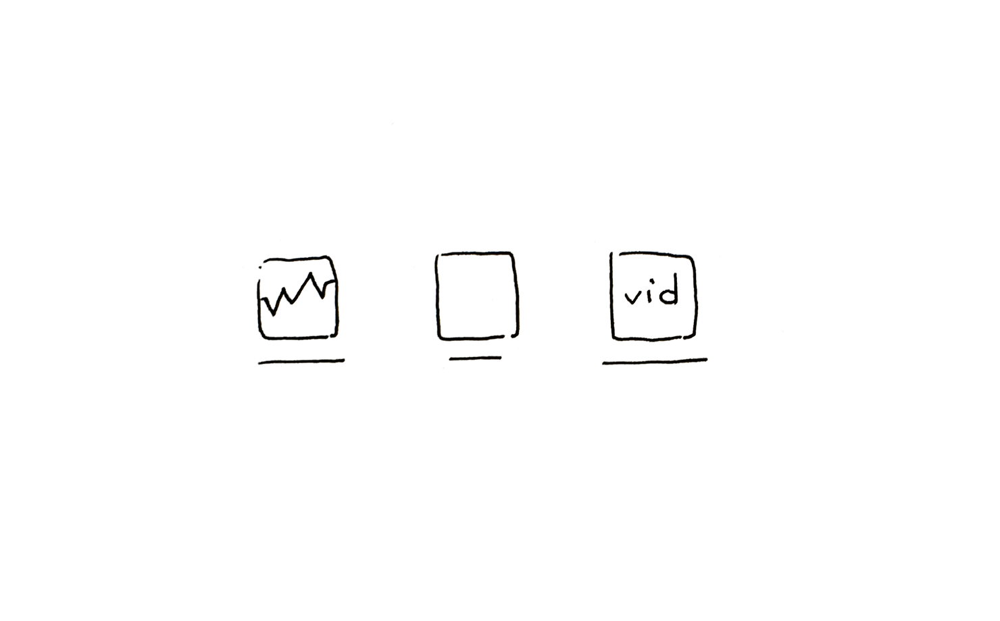

## Beschreibung
Tools sind digitale Anwendungen wie Agenda, Schalttafel, Buzzrank, Zimpel, Shop (fka Kaufhalle), … die Aufgaben erledigen helfen wie Planung für eine Zeitung, Auswahl und Überführung von Material in ein CMS, Embed von Material, Verbreitung von Pressemitteilungen, …. Die Tools  sind mit einer *dpa-ID* erreichbar.

Eigenständig, werden spezifischen Nutzungsbedürfnissen gerecht, setzen Werteinheiten und Akteure in Beziehung.

Tools ermöglichen Arbeit mit den Werteinheiten der dpa: Entscheidung auf Basis von Inhalten, Publizieren von Inhalten

## Skizze

## Designbegründung

Tools habe eine visuelle Repräsentation, die sie als Teil von connect kenntlich macht, aber auch so unterscheidbar und unmissverständlich erscheinen lässt, dass der *Nutzer* schnell erkennen kann, welches Tool gemeint ist.

Der Marktplatz besteht  Tools von dpa oder anderen Anbietern, zwischen denen der Nutzer sich einfach bewegen können soll um Exploration zu ermöglichen. Der Nutzer soll Orientierung bekommen, wo er sich gerade befindet.

## Iterationsrichtung
- Unterscheidbar
- Größe im Kontext

## Ausprägung

- Icon
- Schaltfläche

## Kontext

- in *Loginscreen* der Anwendungen
- im *App switcher*
- in *Notifications*
- in Suchergebnissen
- …

## OOUX-Draft

*Tool*
Name
