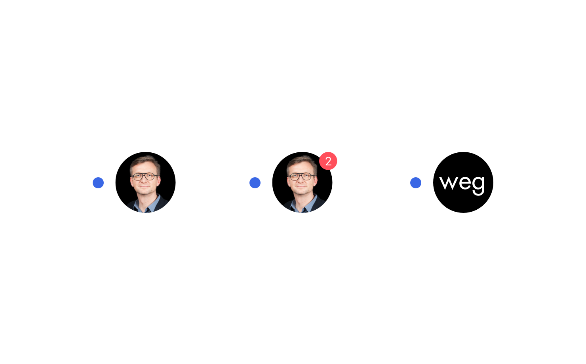
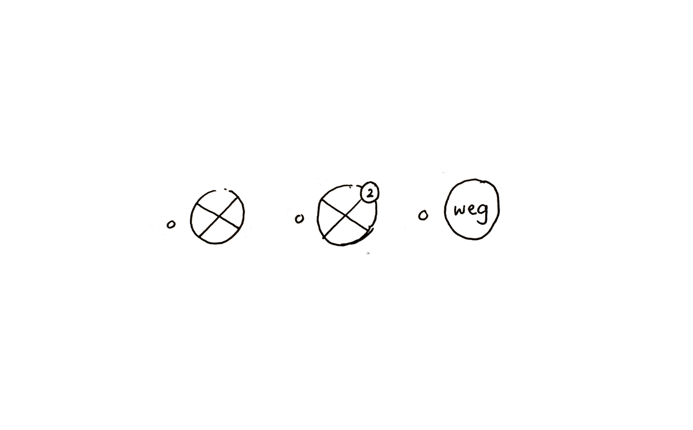
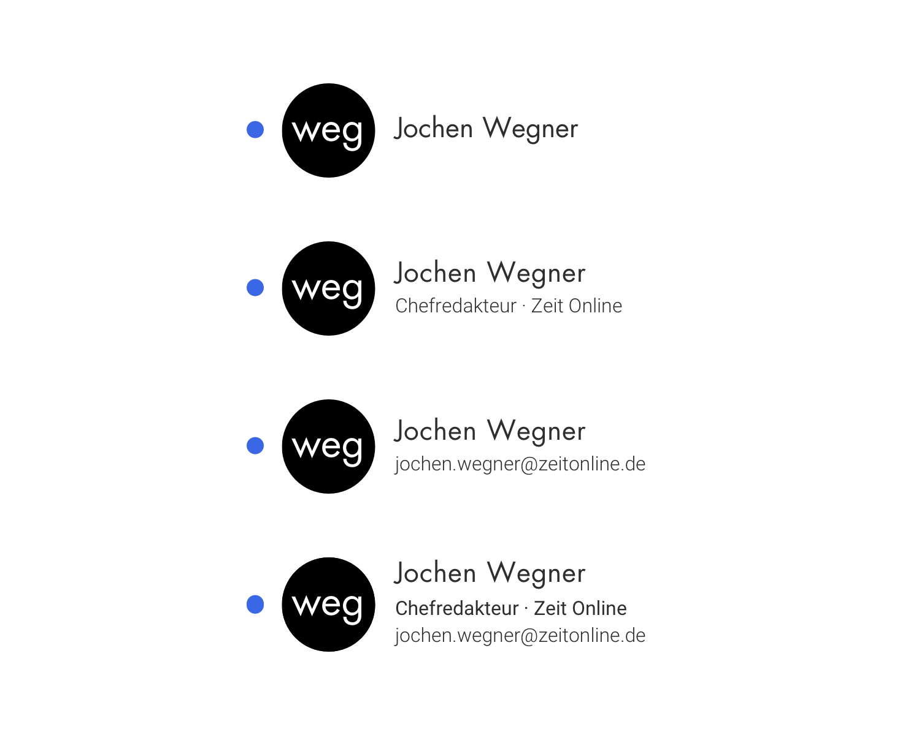
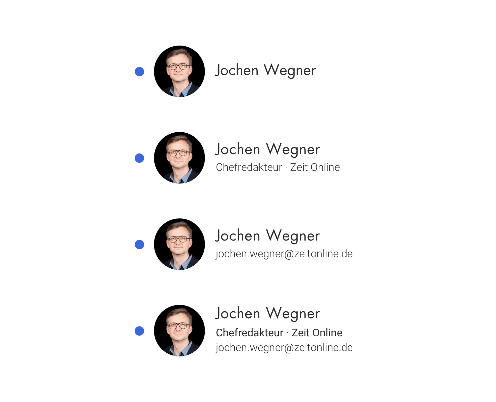
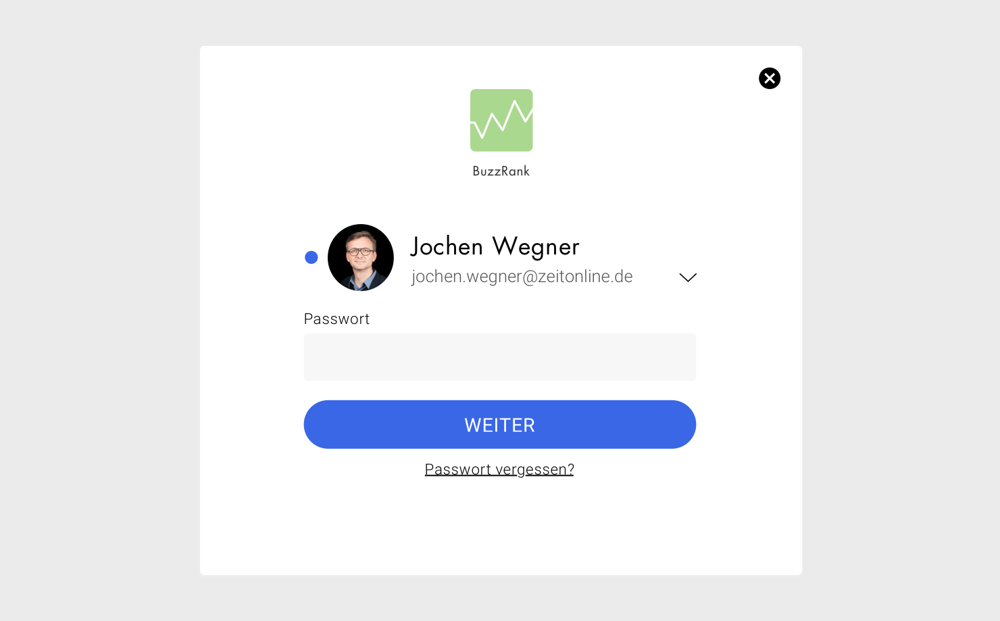
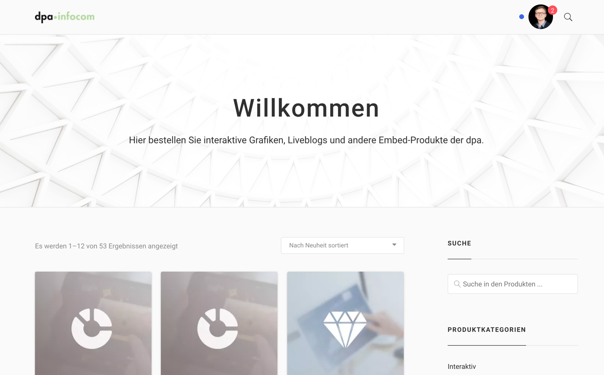

::: tip Iterationssrichtung
- Unterscheidung Nutzer nicht dpa / Nutzer dpa-Mitarbeiter
- Nutzer im Zusammenspiel mit Team
- Wenn kein Bild da ist, wie wird Nutzer unterscheidbar dargestellt werden (Hintergrundfarbe, generierte Patterns, ...)
:::

## Beschreibung

Der Nutzer ist ein Medien- oder Kommunikationsprofi mit einer [dpa-ID](../connect-design-kit/glossar.html#dpa·id), der ein oder mehrere dpa-Tools oder andere über die dpa-ID erreichbare Tools nutzt.

Der Nutzer verfügt über eine __dpa-ID__, d.h. eine Email und ein Passwort mit der er sich einloggen kann.  Der Nutzer
ist eventuell Teil eines Teams. Der Nutzer hat ein Bild oder eine Repräsentanz mit Kürzel. Der Nutzer hat einen Namen.

Der Nutzer ist in unterschiedlichen Rollen auf dem Marktplatz. Er ist als Person identifizierbar, damit er mit anderen identifizierbaren Personen, also Nutzern in Beziehung treten kann (Kommunizieren, Teilen, Kollaborieren) oder er kann mit Werteinheiten in Beziehung treten (kaufen, zum Kauf anbieten, Planen)

## Skizze

## Begründung für die Gestaltung

### Runde Form
Vorbild sind Twitter und Material Design. Insbesondere in Abgrenzung zu der eckigen Form von Tools, die auch als Farbe / Buchstabenkürzel vorliegen können

### Punkt
Der Punkt signalisiert den Nutzer selbst, dass er sich mit der dpa ID angemeldet hat. Es ist nicht irgendein Nutzer, sondern ein Nutzer der dpa.

Stichworte: Markenbildung, Branding für dpa·ID, Bezug zur dpa durch die Farbe grün

## Ausprägung

<cdk-preview title="Nutzer ohne Bild">

</cdk-preview>
<cdk-preview title="Nutzer mit Bild">

</cdk-preview>

## Kontext

<cdk-preview title="bei Login">

</cdk-preview>
<cdk-preview title="ich selbst eingeloggt">

</cdk-preview>

<cdk-preview title="in Kommunikation">

</cdk-preview>

## Ressourcen

- [Sketch-Datei in Abstract](https://share.goabstract.com/dcd88ea2-85bf-4365-b9ff-b44239a9e70b)

## OOUX-Draft

- *Nutzer*
- Bild
- Kürzel
- Name
- Rolle/Titel
- Organisation
- Gehört zu einem oder mehreren Teams
- E-Mail / Passwort

## Code

::: tip Proof of Concept
Der Nutzer kann einfach als Web Komponente über CDN in
bestehende Andwendungen eingebunden werden. Langfristig können Werteinheiten
und Akteure von dpa-Connect als Module auf [npm](https://www.npmjs.com/~dpa-connect)
in Code bereit gestellt werden und von verschiedenen Applikationen konsumiert
werden.
:::

### Einbindung als Web-Component

Als zukunftsgerichtete und standardisierte Technologie ist der Nutzer
exemplarisch als [Web Component](https://developer.mozilla.org/en-US/docs/Web/Web_Components)
umgesetzt.

- [Demo](https://dpa-connect.github.io/web-components-example/)
- [Code](https://github.com/dpa-connect/web-components-example/blob/master/index.html)

---

Einbindung von des Codes über CDN.

    
    
    

#### Eigenschaften

| Name | Typ | Standardwert | Beschreibung |
| ---- | ---- | ------- | -- |
| src | String | '' | Pfad zu Nutzerbild |
| abbr | String | '' | Kürzel |
| size | Number | 48 | Größe in Pixel |
| isDpa | Boolean | false | Ist dpa Mitarbeiter |
| notifications | Number | | Anzahl der Benachrichtigungen |

#### Ausprägungen in Code

Standard

<cdk-user></cdk-user>
    <cdk-user></cdk-user>

Nutzer ist dpa Mitarbeiter

<cdk-user is-dpa="true"></cdk-user>
    <cdk-user is-dpa="true"></cdk-user>

Mit Benachrichtigungen

<cdk-user notifications="5"></cdk-user>
    <cdk-user notifications="5"></cdk-user>

Mit Kürzel

<cdk-user abbr="weg"></cdk-user>
    <cdk-user abbr="weg"></cdk-user>

Mit Bild

<cdk-user src="https://www.gravatar.com/avatar/205e460b479e2e5b48aec07710c08d50"></cdk-user>
    <cdk-user src="https://www.gravatar.com/avatar/205e460b479e2e5b48aec07710c08d50"></cdk-user>

