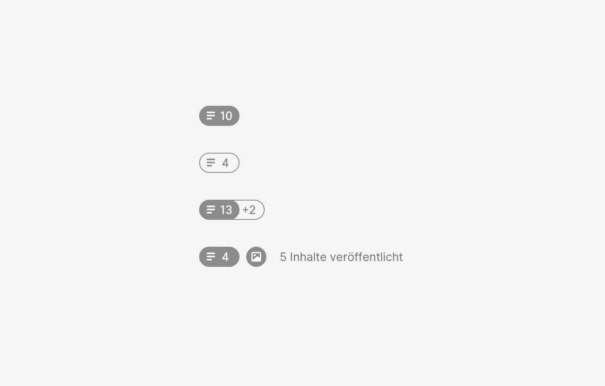

## Beispiel

> 13 Texte gesendet, 2 weitere Texte geplant; Bild(er) und Audio-Inhalt(e) gesendet; Video(s) geplant

## Beschreibung

### Reihenfolge

Die Anzahl der Inhalte wird nur für Medienformat Text gezeigt. Für alle anderen Medienformate wird über
ein Icon indiziert, ob Inhalte gesendet und / oder geplant sind.
Die Reihenfolge der Darstellung richtet sich nach dem [Medienformat](../medienformat), wie folgt:

- Text
- Bild
- Audio
- Video
- Grafik
- Sonstige

</audio>

::: tip Iterationsrichtung
* Darstellung bei geringer Breite
* Form Variante (kein Kreis) testen
* Visuelle Verfeinerung, Rahmenstärke zu Icon Elementen
:::