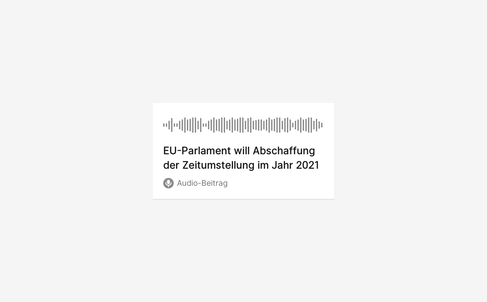
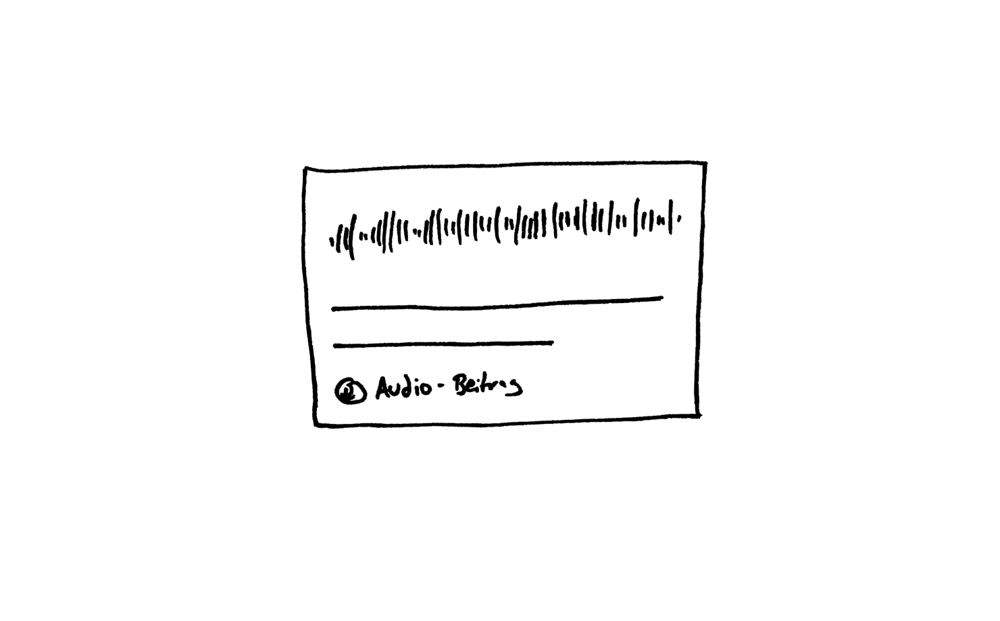
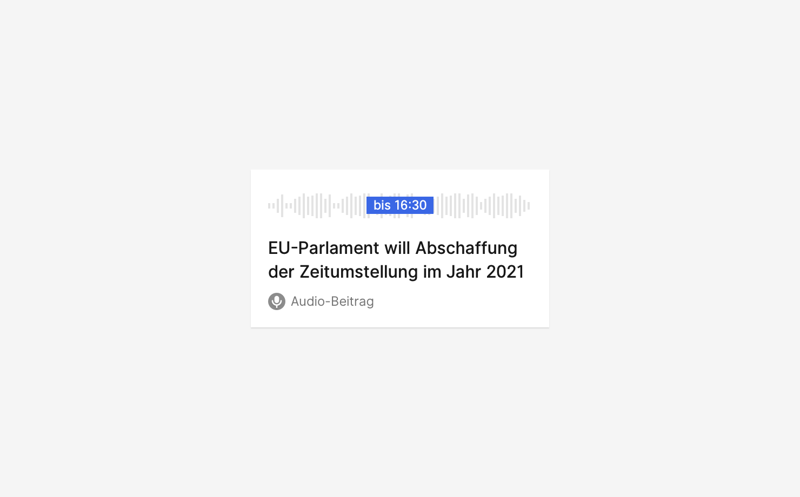

## Beschreibung
Audio  ist ein Inhalt und damit eine journalistische Werteinheiten der dpa oder anderer Anbieter, es ist Bestandteil eines Nachrichtenstücks. Ein Audio wird zur Publikation oder zu Informationszwecken angeboten. 

_Audio, geplant bis 16:30_

## Ausprägung
* ☑️im Zustand des Versprechens (Planung)
* ☑️ gesendet (manifestiert.)
* ☑️ Minimalform
* in Liste 
* als Detailansicht

## Kontext
* in Agenda am **Termin** / **Thema**
* in dpa-news
* im Hub / Hub app
* in E-Mail

## OOUX-Draft

**Audio**

- 

