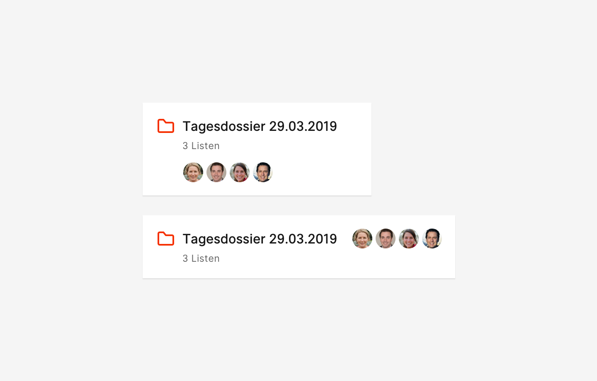

## Beschreibung
Der gemeinsame Arbeitsraum für Kollaboration ist die *Mappe*. Es gibt Mappen, die von der dpa (oder fremden Dritten) zur Verfügung gestellt werden und es gibt Mappen, die sich Nutzer selbst erstellen können. Zusätzlich gibt es Mappen-Templates für bestimmte Anwendungsfälle. Die Individualisierung des gemeinsamen Arbeitsraums Mappe entsteht über Titel und Farbe (vgl. Vergleiche Farbschemas bei Slack, die Einstellung der Hintergrundfarbe bei Trello).

Das Konzept der Mappe funktioniert technisch und vom Nutzerverständnis her ohne die Detailansichten der einzelnen Werteinheiten zu zeigen. Die Mappen sind sowohl aus der Anwendung als auch aus dem Hub zu erreichen.

## Ausprägung
* ☑️Fullscreen
* ☑️ Sidebar

## Kontext
* in Agenda

## OOUX-Draft

**Mappe**
- Titel
- Farbe

