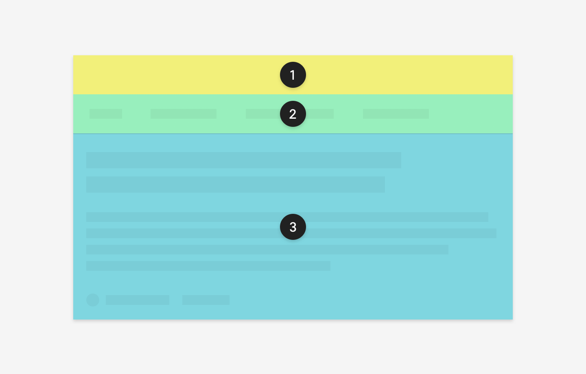

## Beschreibung
Ein Nachrichtenstück läßt sich in verschiede Werteinheiten zerlegen, die eine visuelle Gestaltung und eine definierte Anordnung haben. In unterschiedlichen Kontexten können unterschiedliche viele Werteinheiten  eines Nachrichtenstücks angezeigt werden. 

- Autor: Person / Team / Organisation
- Version
- Klassifizierung
- Inhalte: Text / Bild / Video / Grafik / Audio
- Notizen

Der dpa-Kunde arbeitet mit einem Nachrichtenstück, um den **Inhalt** (der Teil des Nachrichtenstücks ist) bestmöglich an seine Kunden auszuspielen.

_Spezifikation für ein Nachrichtenstück in der Listenansicht für Select_

## Zukünftige Weiterentwicklung

* Nachrichtenstück im Nachrichten-Paket
* Notizblock als eigene Werteinheit
* Autor als eigene Werteinheit 

## Ausprägung
* Karte
* Detailansicht 

## Kontext
* in agenda
* in select
* in dpa-news

## OOUX Draft
**Nachrichtenstück**
Akteur
Klassifizierung
Version
Inhalte: Text / Bild / Video / Grafik / Audio
Notizen

