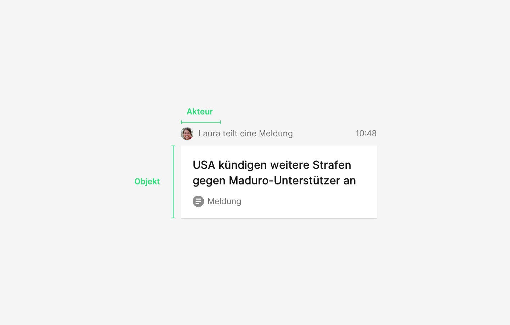

## Beschreibung Vokabular

Bezeichnung | Term | Beispiel
---|---|---
Akteur    | Actor    | Akteure: Person, Team, Organisation
Aktion    | Action   | Publizieren, Teilen, Einladen
Objekt    | Object   | Werteinheiten: Text, Bild, Grafik, Filter, Thema, Termin, ...
Kontext   | Context  | Filter, App
Ursprung  | Origin   | Liste
Ziel      | Target   | Liste
Adressat  | Consumer | Akteure: Person, Team, Organisation

### Akteur (Actor)

beschreibt den Handelenden einer Aktivität

Beispiel: Team Terminredaktion

### Aktion (Action)

beschreibt die Tätigkeit

Beispiel: Publizieren

### Objekt (Object)

beschreibt die Werteinheit der Aktivität

Beispiel: Termin

### Ursprung (Origin)

(optional) beschreibt den Urspung / Herkunftsort der Werteinheit vor Ausführung der Aktion

### Ziel (Target)

(optional) beschreibt das Ziel / Bestimmungsort der Werteinheit nach Ausführung der Aktion

### Adressat (Consumer)

beschreibt den Adressat, das heißt eine Person für den diese Aktivität sichtbar wird oder an den sich diese Akitivität gezielt richtet

Beispiel: Ein Nutzer von Agenda

### Kontext (Context)

beschreibt den Kontext in dem die Aktivität für den Empfänger relevant ist

Beispiel: Ein Filter (erster Kontext) innerhalb von Agenda (zweiter Kontext)

## Szenarien

### Beispiel: Text (Select)

dpa (Actor) veröffentlicht (Action) Text (Object). Der Text passt in Filter 'Politik Hamburg' (Context 1) in Select (Context 2).

- Für einen Nutzer würde diese Aktivität sichtbar, wenn er den Filter 'Politik Hamburg' (Context 1) beobachtet

Akteur | Aktion | Objekt | Kontext
---|---|---|---
dpa    | publiziert | Text | Filter, dpa-select

### Beispiel: Termin (Agenda)

dpa Terminredaktion (Actor) veröffentlicht (Action) Termin (Object). Die Termin passt in Filter 'Politik Hamburg' (Context 1) in Agenda (Context 2).

- Für einen Nutzer würde diese Aktivität sichtbar, wenn er den Filter 'Politik Hamburg' (Context) beobachtet

Akteur | Aktion | Objekt | Kontext
---|---|---|---
dpa | publiziert | Termin | Filter, Agenda         

### Beispiel: Teilen

Eine Person (Actor) teilt (Action) einen interessanten Termin (Object) mit einem Kollegen (Consumer).

- Für den Kollegen wird diese Aktivität sichtbar (es sei denn, die Person, die den Termin teilt steht auf seiner Blackliste)

Akteur | Aktion | Objekt | Consumer
---|---|---|---
Person | teilt | Bild | Kollegen

### Beispiel: Mappe
Nutzer (Actor) schiebt (Action) Meldung (Object) von Liste 'Ideen' (Origin) in Liste 'Nächste Ausgabe' (Target) in Mappe 'Planung' (Context 1) im dpa·Hub (Context 2)

- Für einen Nutzer würde diese Aktivität sichtbar, wenn die Mappe 'Planung' beobachtet

Akteur | Aktion | Objekt | Ursprung | Ziel | Kontext
---|---|---|---|---|---
NutzerA | verschiebt | Text | Liste 1 | Liste 2 | Mappe, dpa·Hub