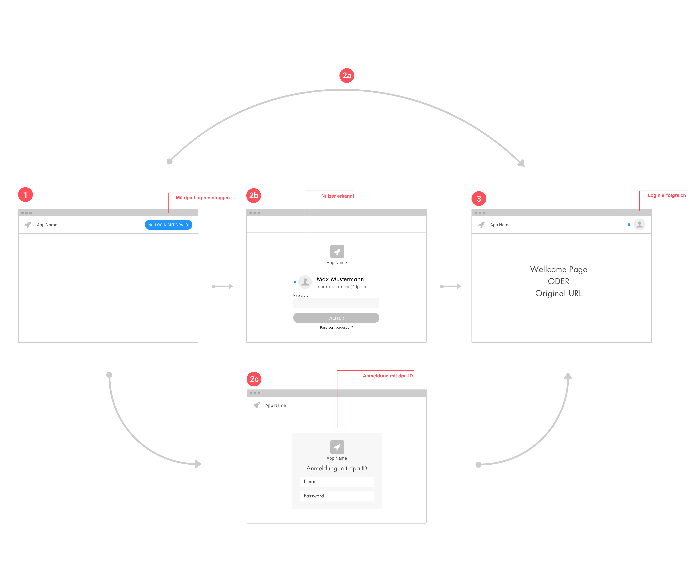

# Wiederholtes Anmelden mit dpa·ID

Wiederholtes Anmelden an einem Tool, im Unterschied zu [erstmaliger Nutzung mit dpa·ID](./erstmalige-nutzung-mit-dpa-id).

## Beschreibung

### Ziel
Der Anbieter eines Tools möchte den Zugang zu seinem Tool kontrollieren und daher prüfen, ob ein Nutzer berechtigt ist, das Tool zu nutzen.
Der Anbieter möchte persönliche Einstellungen erlauben.

### Bedürfnis
Der Nutzer möchte sich anmelden, um das Tool zu nutzen und/oder innerhalb eines Tool ein persönliches Nutzererlebnis haben.

### Situation
- Der Nutzer hat das Tool bereits genutzt.
- Der Nutzer möchte Funktionen des Tools auf einem anderen Rechner nutzen.
- Der Nutzer möchte auf bestimmte Daten zugreifen.

## Flow

### <Step number="1" /> 1 Schritt 1
#### Was passiert
Nutzer gibt URL von der App ein

#### Was sieht er
Login mit dpa·ID Button

#### Hinweise
Der dpa·ID Button sollte immer vorgaben-getreu eingebunden werden und prominent dargestellt werden. Andere Login-Möglichkeiten kann es zusätzlich auch geben.

### <Step number="2" /> Schritt 2

#### Was passiert
Das System leitet den Nutzer zum Login Screen für die dpa·ID weiter.

#### Was sieht er

##### <Step number="2a" /> Der Nutzer ist am System angemeldet
Direkte Weiterleitung zurück in die App

##### <Step number="2b" /> Der Nutzer dem dpa ID System bekannt
Der Screen wird vollflächig angezeigt. Auf dem Screen wird das Tool, für den sich der Nutzer anmeldet, angezeigt. Außerdem ist der Nutzer selbst angegeben. Der Nutzer muss lediglich das Passwort-Feld ausfüllen.

##### <Step number="2c" /> Der Nutzer ist nicht bekannt
Der Nutzer kann Nutzername oder Passwort angeben.

#### Hinweise
Hinweise zur Gestaltung des Tool Identifikationsbildes

### <Step number="3" /> Schritt 3

#### Was passiert
Der Nutzer hat anmelden geklickt.

#### Was sieht er

##### <Step number="3a" />
Das Tool mit Inhalten und Funktionen. Eine Bestätigung, dass die Anmeldung mit der dpa·ID funktioniert hat. Sein eigenes Profilbild oder Kürzel.

**Hinweise**
Das Profilbild soll oben rechts positioniert werden. Die Bestätigung, dass die Anmeldung erfolgreich war, erfolgt als Animation am Profilbild.

[Code-Skizze für Animation in Code-Pen](https://codepen.io/anon/pen/deqGVP)

##### <Step number="3b" />
Eine Fehlermeldung, dass der Nutzer nicht berechtigt ist das Tool zu benutzen.

::: tip Iterationssrichtung
- Spezifikation für Assets und Informationen für Login Formular
- Einsatzhinweise zum Login-Flow: Redirect, kein Popup
:::
