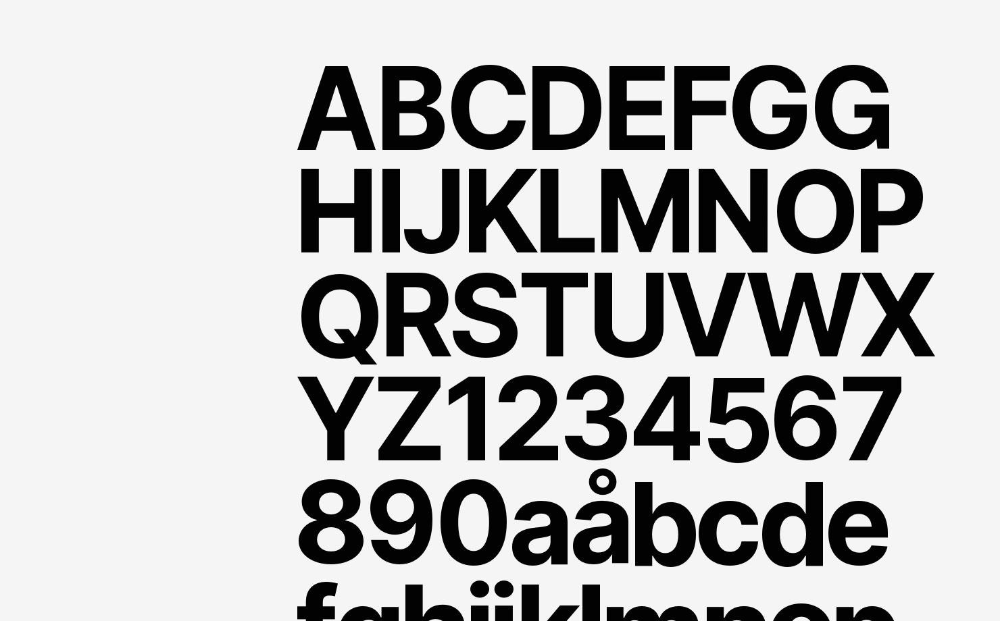

# Beschreibung
Die [Inter Schriftfamilie](https://rsms.me/inter/ "Inter Font Website") wurde speziell für die Darstellung von kleinen bis mittelgroßen Texten auf Bildschirmen entwickelt. Sie ist multilingual einsetzbar und dank "SIL Open Font License" frei verfügbar.

In der folgenden Übersicht sind die eingesetzten Stile mit Größen, Zeilenabständen sowie Laufweite definiert.

<TypographySpecimen src="typography.json"></TypographySpecimen>

# Marketing

Für Marketingseiten und -elemente ist zusätzlich die Futura, 1927 entworfen von Paul Renner, für Überschriften einsetzbar. Futura ist nicht frei verfügbar, auf Seiten der dpa wird [Futura BT](https://www.fontshop.com/families/futura-bt "Futura BT im Fontshop"), herausgegeben von Bitstream, genutzt.

<TypographySpecimen src="typography-marketing.json"></TypographySpecimen>