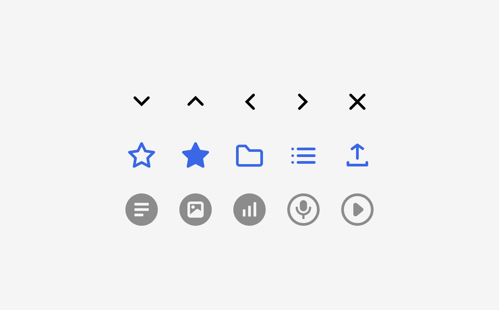

# Icons

Wir unterscheiden in der Gestaltung folgende Icons nach ihrem Einsatzzweck:

1. Funktionale Icons für Interaktionen
2. Icons zur Typisierung der Werteinheit Inhalt
3. Icons zu App-spezifischen Typisierung und Auszeichnung
4. App Icons

## Funktionale Icons für Interaktionen

Funktionale Icons verdeutlichen eine Interaktion.

Es gibt:

- **Generische Interaktionen** wie *Schließen*, *Info*, *Löschen*, *Ausklappen* sind systemweit festgelegt
    - für diese Interaktion kann das im Design Kit festgelegt Icon verwendet werden, oder
    - es wird das Icon aus dem verwendeten UI-Kit, der Plattform verwendet)
- **Domainen-spezifische Interaktionen**, in der Regel im Zusammenhang mit Textproduktion, wie *Bearbeiten* oder *Ansehen*
    - für diese Interaktion sollte das im Design Kit festgelegt Icon verwendet werden
- **dpa Connect spezifische Interaktionen**, wie *Weiterleiten*, *Beobachten*, *Einladen*, *zur Mappe hinzufügen*. Diese Interaktionen nutzen Connect Services
    - für diese Interaktion muss das im Design Kit festgelegt Icon verwendet werden, damit die Interaktion auf dem gesamten Marktplatz in unterschiedlichen Anwendungen für den Nutzer verständlich ist

## Icons zur Typisierung der Werteinheit Inhalt

Die Icons sind systemweit festgelegt und betreffen die Auszeichnung der unterschiedlichen Medienformate.

[Siehe: Werteinheiten / Medienformat](/Werteinheiten/Medienformat)

## Icons zu App-spezifischen Typisierung und Auszeichnung

Die visuelle Sprache dieser Icons ist systemweit festgelegt und soll sich von den funktionalen Icons unterscheiden. Die Icons an sich können von Anwendung zu Anwendung unterschiedlich sein.

Zur Zeit werden Icons zur Typisierung von Top-Termin in Agenda und von Eilmeldungen in Select eingesetzt.

## App Icons

Die App Icons reprensentieren eine App und werden im App Switcher, als Favicon und im Login-Dialog verwendet. Die App Icons der dpa Gruppe basieren auf wohl definierten Gestaltungsprinzipien.

[Siehe: Marketing](/Marketing/App-Icons)
