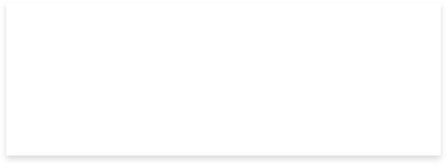

# Elevation 1

<Playground>
  
</Playground>

<CodeBlock title="elevation-1">

</CodeBlock>

# Elevation 2

<Playground>
  
</Playground>

<CodeBlock title="elevation-2">

</CodeBlock>

# Elevation Slot State

<Playground>
  
</Playground>

<CodeBlock title="elevation-slot-state">

</CodeBlock>