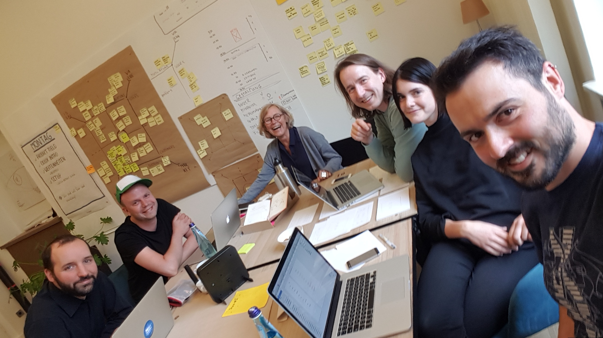

# Prozess

Die vorliegende Version wurde in zwei Phasen erarbeitet.

Die erste Version ist im connect Design Kit Sprint im April 2018 innerhalb von 5 Tagen entstanden. Im ersten Schritt wurde aufgezeigt, wie das Kit funktioniert, gepflegt und genutzt werden kann; es war bei weitem noch nicht vollständig.

In der zweiten Phase, die im Mai 2019 gestartet ist wurde das mittlerweile durch die Entwicklung der Produkte Agenda und Select gewachsene Gestaltungs-Verständnis umfangreich dokumentiert.

## Team, Design Kit Sprint 2018

