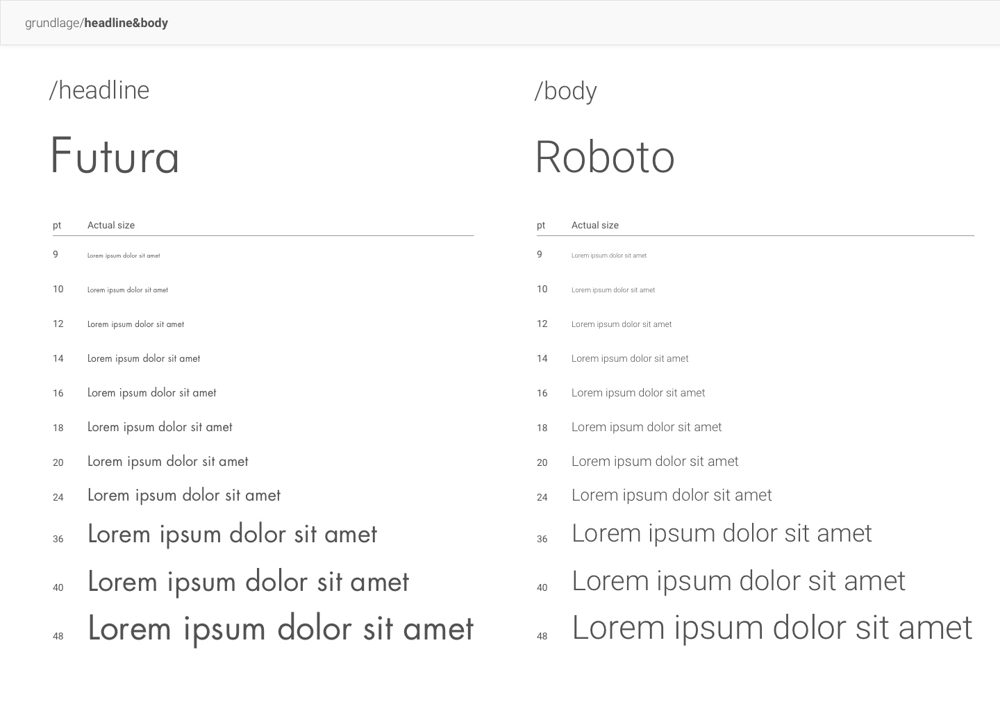
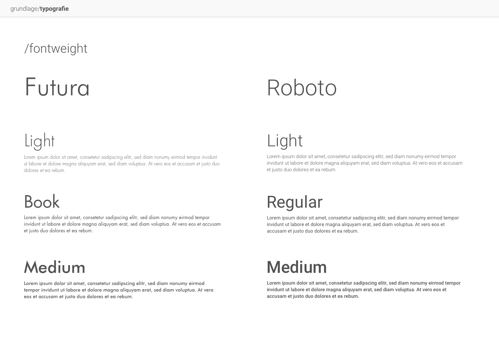
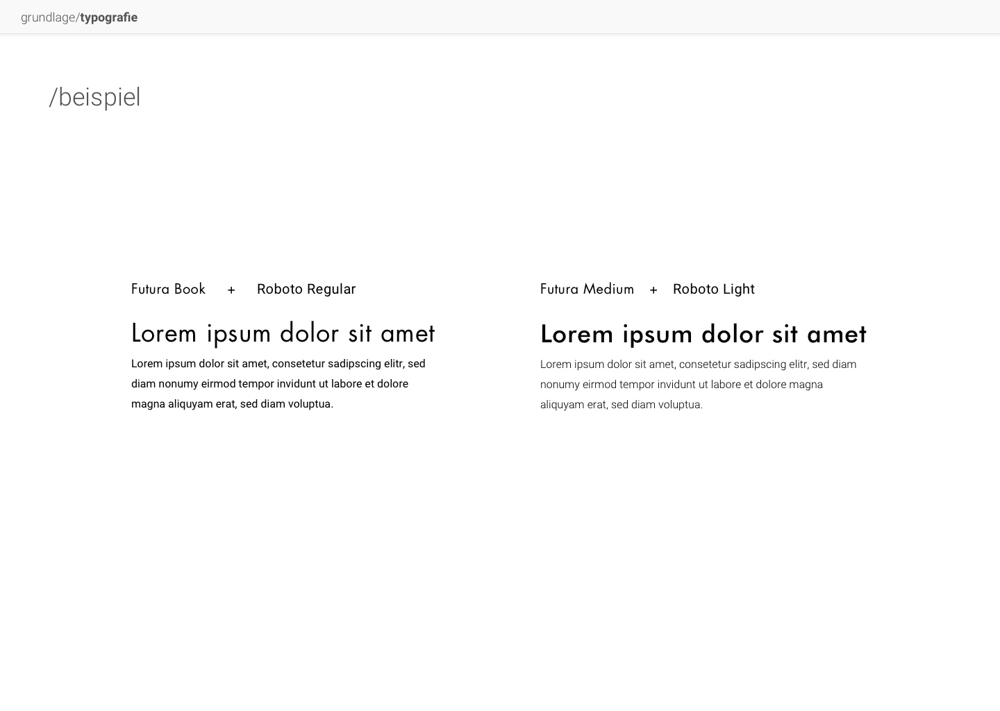
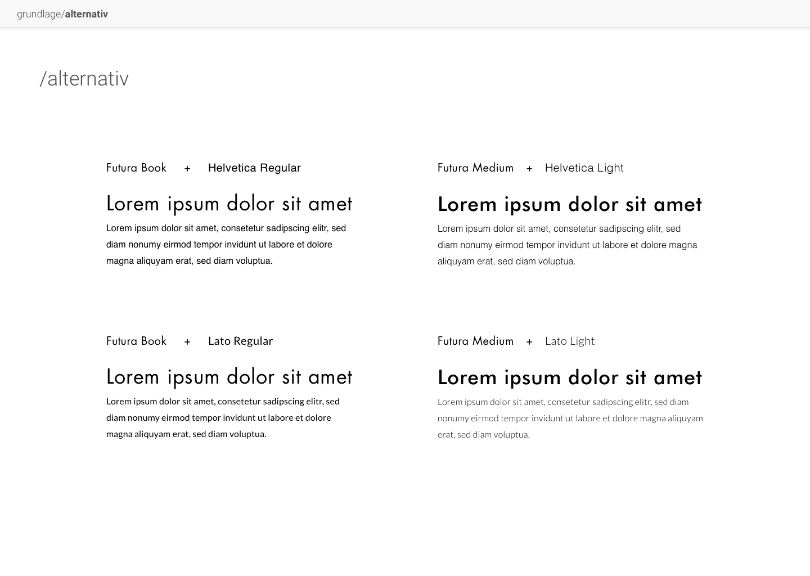

# Schriftart

::: tip Iterationsrichtungen
1. Dokumentation: Einbindung als Beispiel in HTML / CSS
2. Dokumentation: Beschreibungstext für Font Pairing
3. Type-Scale, Anzahl an Größen reduzieren
4. Einsatzregel für Typescale, zum Beispiel: Größe für Headlines und Body-Text bestimmen
:::
