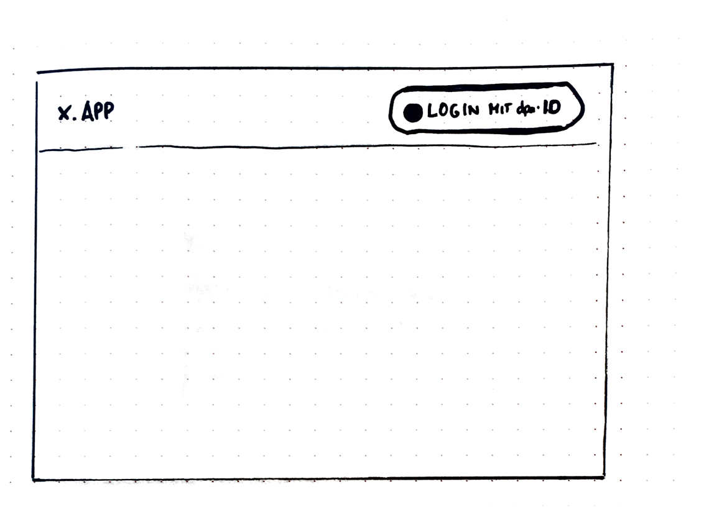
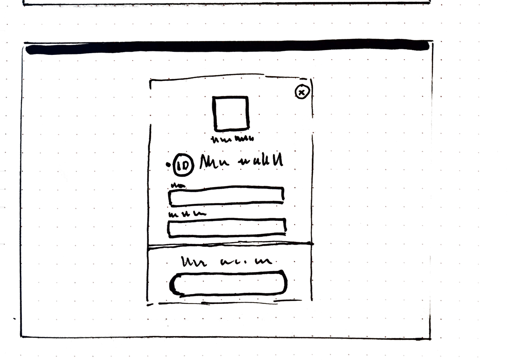
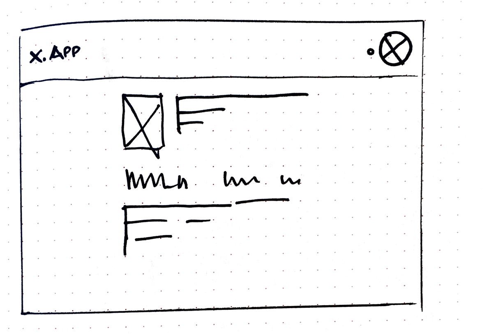

# Anmelden mit dpa·ID

Wiederholtes Anmelden an einem Tool

## Beschreibung

### Ziel
Der Anbieter eines Tools möchte ein Tool schützen und daher prüfen, dass ob ein Nutzer berechtigt ist, das Tool zu nutzen.
Der Anbieter möchte persönliche Einstellungen erlauben.

### Bedürfnis
Der Nutzer möchte sich anmelden, um die Tool überhaupt zu nutzen oder innerhalb einer Tool ein persönliches Nutzererlebnis zu haben.

### Situation
- Der Nutzer hat das Tool bereits genutzt.
- Der Nutzer möchte Funktionen von dem Tool auf einem anderen Rechner nutzen
- Der Nutzer möchte aus bestimmte Daten zugreifen

## Flow

### Schritt 1
**Was passiert**
Nutzer gibt URL von der App ein

**Was sieht er**

Login mit dpa Button

**Hinweise**
Der Button sollte immer gleichberechtigt

### Schritt 2
**Was passiert**
Das System leitet den Nutzer zum Login Screen für die dpa·ID weiter.

**Was sieht er**

1. Der Nutzer ist am System angemeldet
Direkte Weiterleitung zurück zu App

2. Der Nutzer dem dpa ID System bekannt
Der Screen wird vollflächig angezeigt. Auf dem Screen wird das Tool für den sich der Nutzer anmeldet angezeigt. Außerdem ist der Nutzer selbst angegeben. Der Nutzer muss lediglich das Passwort-Feld angeben.

3. Der Nutzer ist nicht bekannt

Der Nutzer kann Nutzername oder Passwort angeben.

**Hinweise**
- Hinweise zur Gestaltung des Tool Identifikationsbildes

### Schritt 3

**Was passiert**: Der Nutzer hat anmelden geklickt

**Was sieht er**

Das Tool mit Inhalten und Funktionen. Eine Bestätigung, dass die Anmeldung mit der dpa·ID funktioniert hat. Sein eigenes Profilbild oder Kürzel.

**Hinweise**
Das Profilbild soll oben rechts positioniert werden. Die Bestätigung, dass die Anmeldung erfolgreich war erfolgt als Animation am Profilbild.

[Code-Skizze für Animation in Code-Pen](https://codepen.io/anon/pen/deqGVP)
