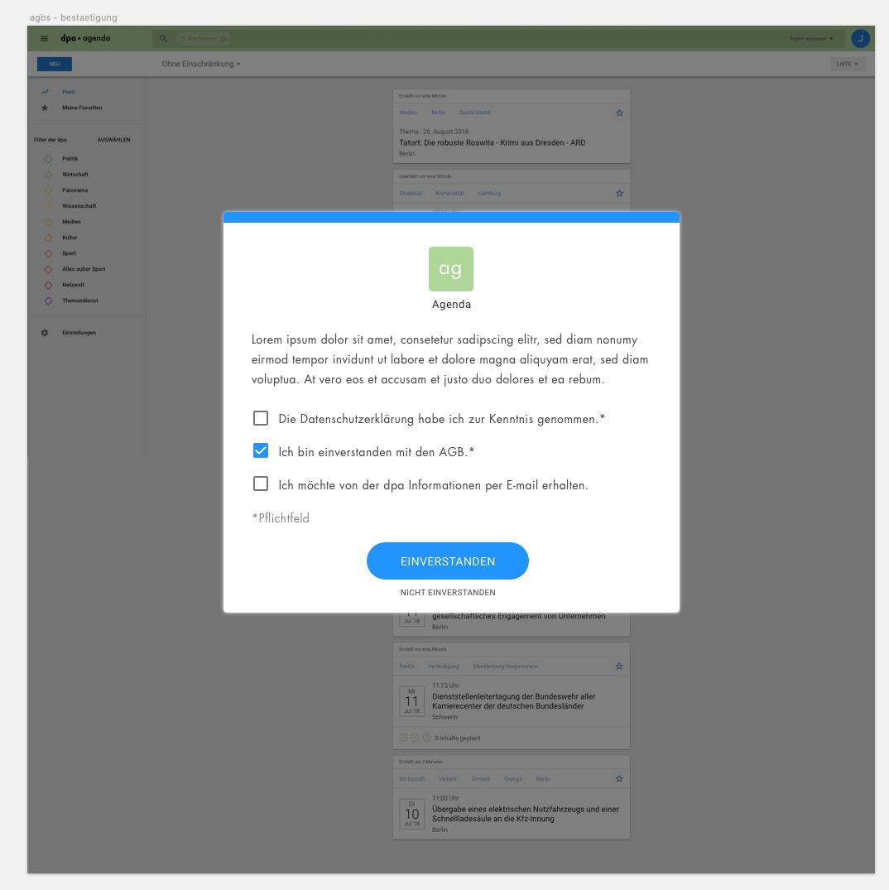
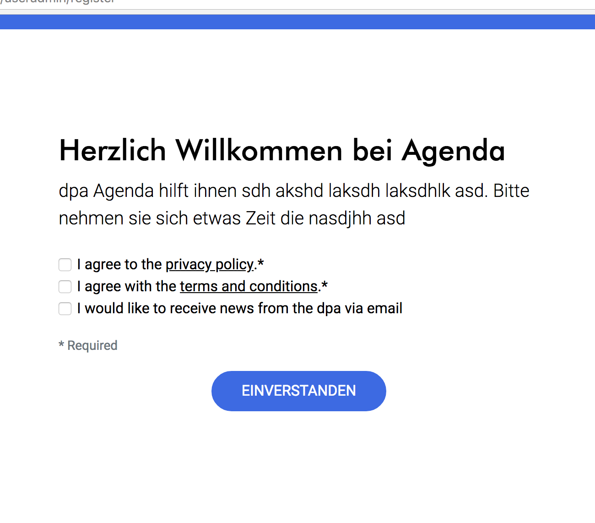

<TagList :items="$page.frontmatter.tags" title="Tags" />
# Dialog
<SynonymList :items="$page.frontmatter.synonyms" title="Synonyme"></SynonymList>

::: tip Iterationsrichtung
* Visuelle Gestaltung
:::

<cdk-preview title="Erster Entwurf (wip)">

</cdk-preview>

<cdk-preview title="Skizze / Schriftgrößen">

</cdk-preview>