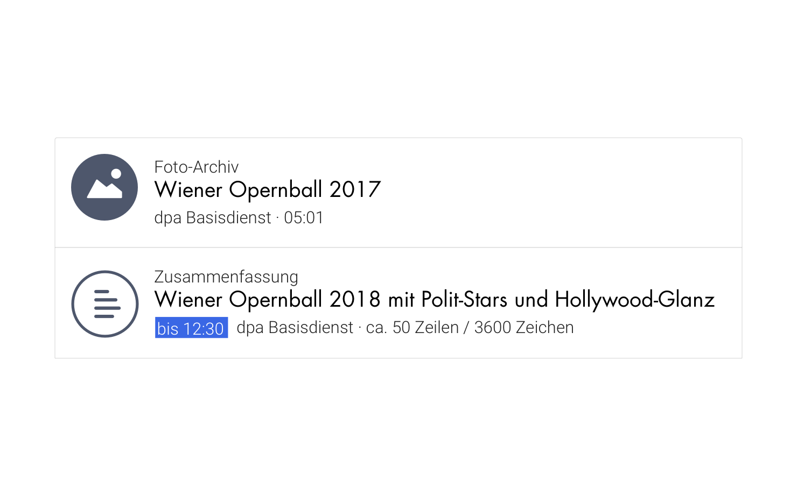

<TagList :items="$page.frontmatter.tags" title="Tags" />
# {{$page.frontmatter.title}}
<SynonymList :items="$page.frontmatter.synonyms" title="Synonyme"></SynonymList>

Berichterstattung ist die Summe aller gesendeten und geplanten [Inhalte](./inhalt.md) der dpa oder anderer Anbieter zu einem bestimmten Thema oder Termin.

## Gestaltung

## Skizze

## Beschreibung
Inhalt ist eine journalistische Werteinheiten der dpa oder anderer Anbieter. Ein Inhalt wird zur Publikation oder zu Informationszwecken angeboten.

Inhalte gibt es in unterschiedlichen *Medienformaten*. Inhalte werden in unterschiedlicher Weise geklammert z.B.  als *Wire*, als Paket, als Serie, als Rubrik. Die Ausgestaltung von einem Inhalt unterscheidet sich nach Medienformat und Genre.  Einen Inhalt gibt es in unterschiedlichen Darreichungsformen je nach Medienformat.

Ein Inhalt ist eine handelbare Werteinheit auf dem Marktplatz. Inhalt ist in fast allen Tools der dpa präsent. Inhalt ist die Werteinheit, die  an Kunden ausgeliefert wird und für die Kunden heute bezahlt.

::: tip Iterationsrichtung
* Inhalt als Versprechen (geplant) und Inhalt manifest (gesendet) visuell strukturelle unterscheiden; Idee: Hintergrund strafiert?
* Überprüfen in welcher UI-Form Abgrenzung von Paket und Inhalt gerechtfertigt ist
* Unterschiedliche Stati (kill, cancel) zum Ausdruck bringen
* Umgang mit unterschiedlichen Medienformaten: Bilder darstellen, ... @todo: Exploration hochladen
:::