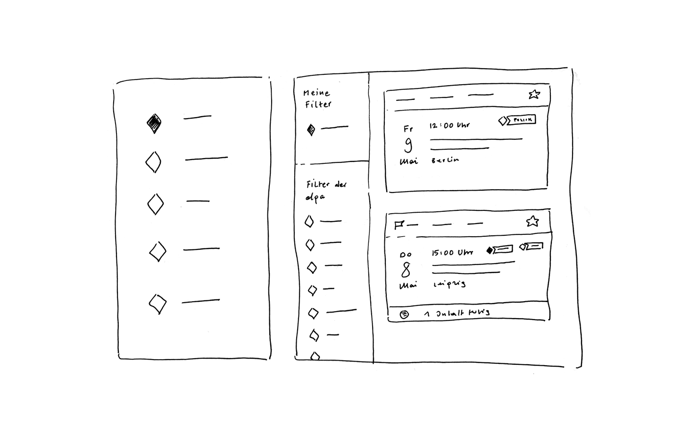

# Filter

Ein Filter ist eine Menge an Filterregeln für Datenströme

Ein Filter hat einen Namen.

Ein Filter dient dem Nutzer dazu für ihn relevante Datenströme zu bekommen.

## Gestaltung

## Skizze

## Kontext

A

B

C

