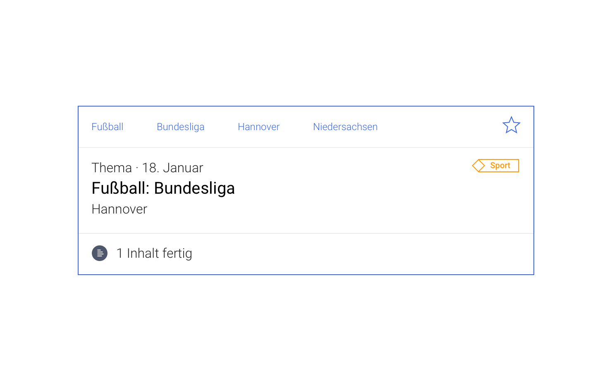
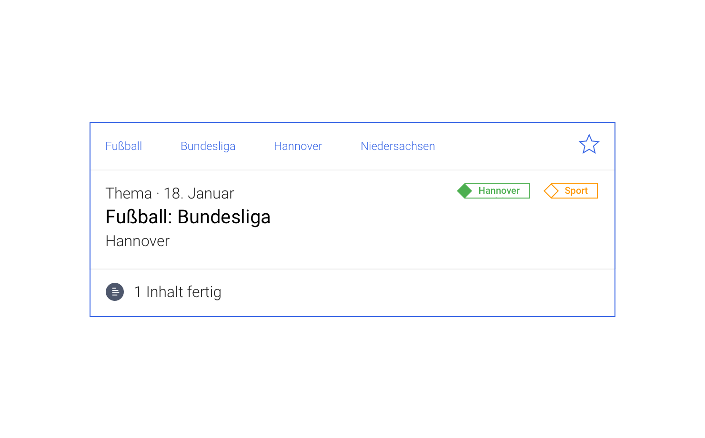
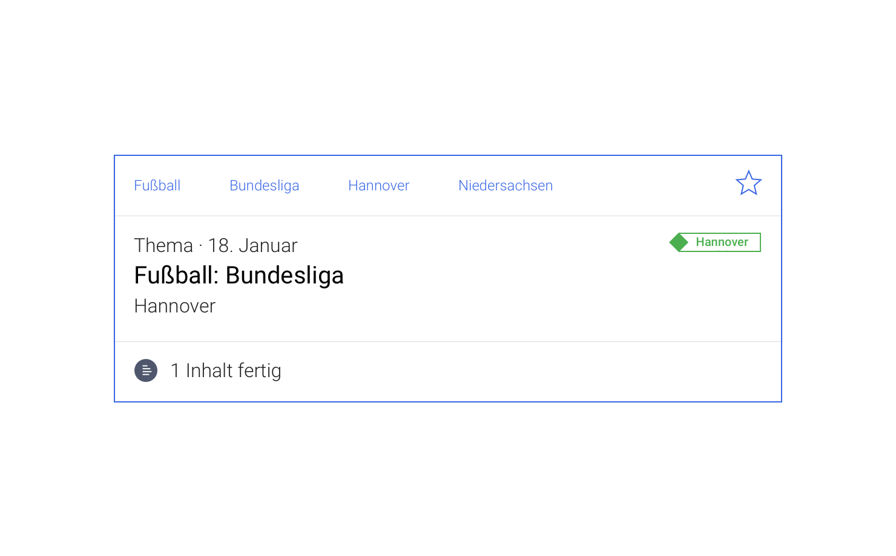

# Filter

Ein Filter ist eine Menge an Filterregeln für Datenströme

Ein Filter hat einen Namen.

Ein Filter dient dem Nutzer dazu für ihn relevante Datenströme zu bekommen.

## Gestaltung

::: tip Iterationsrichtungen
1. Gefüllte 'Fahne' für eigene Filter
2. WKW Filter für Farbblind und Sehbeeinsträchtigte unterscheidbar gestalten?
3. Idee: Andere Formen als Raute als Unterscheidungsmerkmal zulassen?
:::

## Skizze

## Kontext

<cdk-preview title="A">

</cdk-preview>
<cdk-preview title="B">

</cdk-preview>
<cdk-preview title="C">

</cdk-preview>
