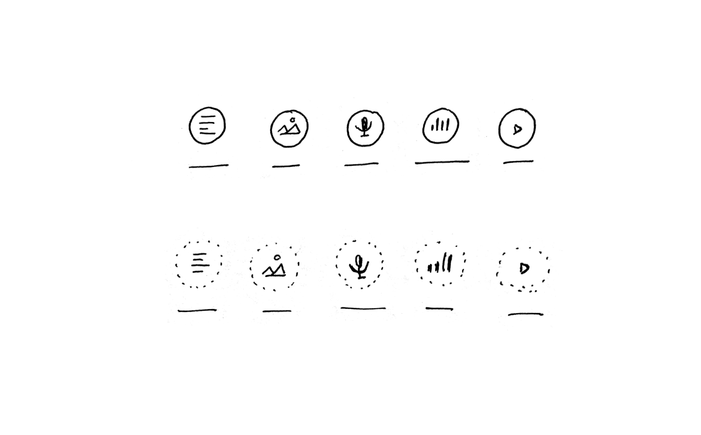

# Medienformat

Medienformat klassifiziert *Inhalt*

## Beschreibung
Medienformat klassifiziert einen Inhalte als *Text*, *Bild*, *Grafik*, *Video*, *Audio* oder *Embed*

Medienformat  ist eine allgemein bekannte Klassifizierung von Inhalten, die nicht dpa-spezifisch ist.

Medienformate erleichtern Orientierung in der Menge an Inhalten. Medienformate fungieren auch als Filter. Medienformate erleichtern die Konsumierbarkeit von Inhalt für Publikation oder Information.

## Gestaltung

## Skizze

## Begründung für Gestaltung
Hat ein erkennbares Erscheinungsbild und einen Namen. Medienformat ist anschlussfähig für unterschiedliche Tools mit unterschiedlicher Content-Dichte (Agenda, Schalttafel)

## Iterationsrichtung
* Unterscheidbar
* Größe im Kontext

## Ausprägung
* in Listenansichten
* in Filtern
* als Navigationselement (contextual navigation)
* in Notification

## Kontext
* in Agenda am *Termin* / *Thema*
* in der Schalttafel
* in dpa-news
* in Select
* …

## OOUX-Draft
*Medienformat*
Name
