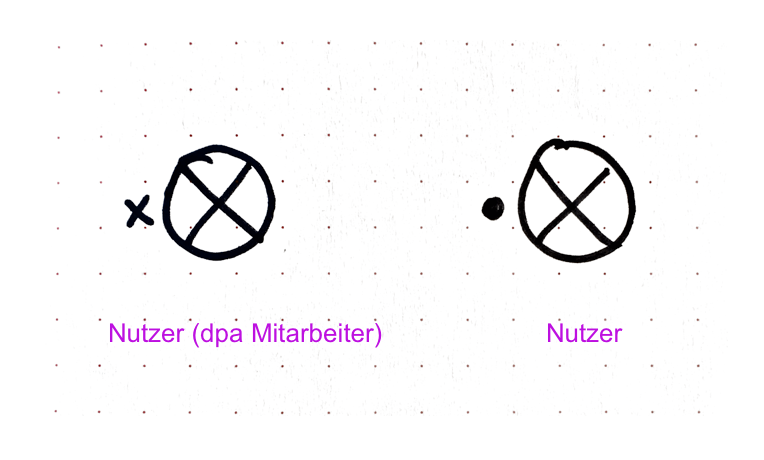
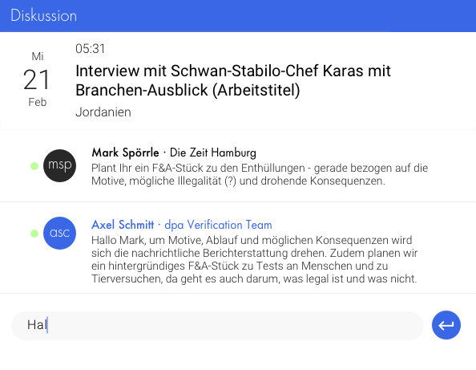
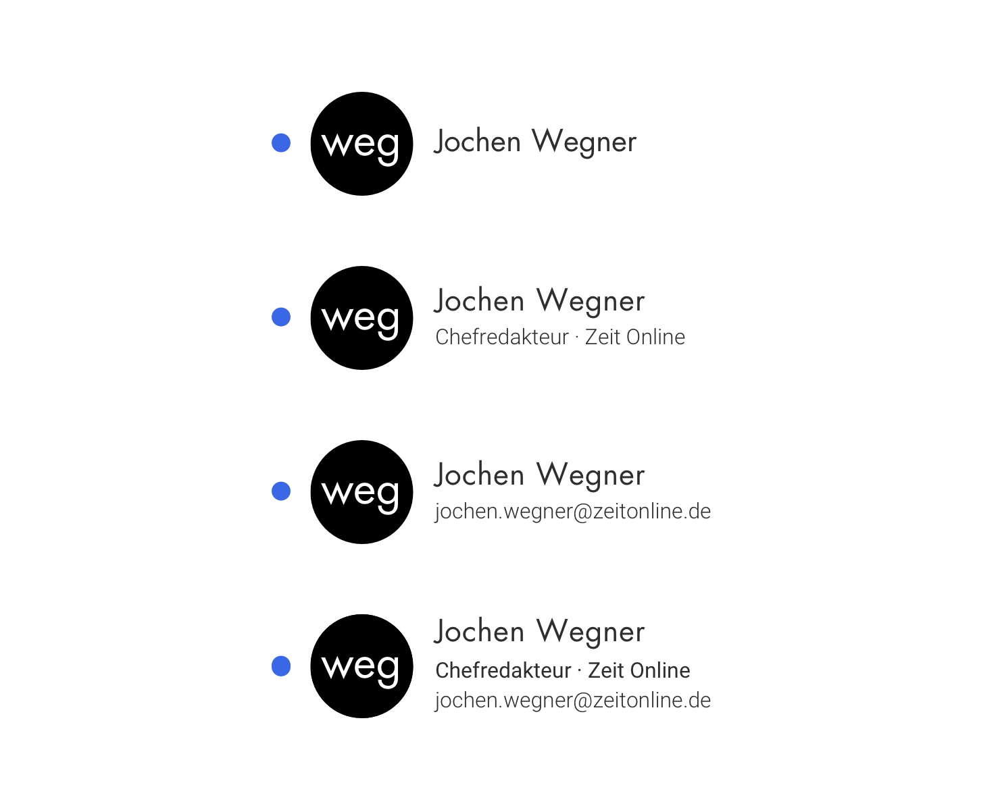
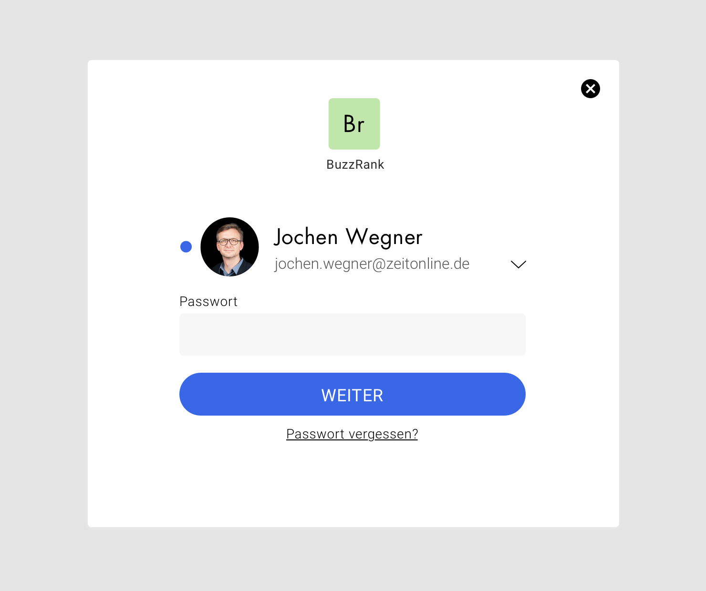
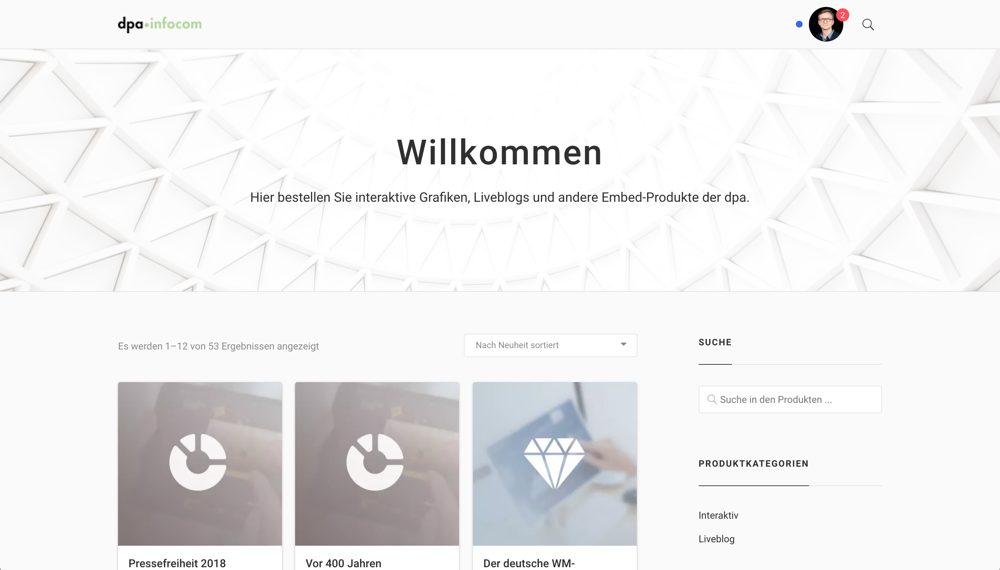

<TagList :items="$page.frontmatter.tags" title="Tags" />

# Nutzer

<SynonymList :items="$page.frontmatter.synonyms" title="Synonyme"></SynonymList>

Der Nutzer ist eine Person, die  dpa- und Fremdtools nutzt. Der Nutzer ist Marktplatz-Teilnehmer.

## Beschreibung

Der Nutzer ist ein Medien- oder Kommunikationsprofi mit einer dpa-ID, der ein oder mehrere dpa-Tools oder andere über die dpa-ID erreichbare Tools nutzt.

Der Nutzer verfügt über eine __dpa-ID__, d.h. eine Email und ein Passwort mit der er sich einloggen kann.  Der Nutzer
ist eventuell Teil eines Teams. Der Nutzer hat ein Bild oder eine Repräsentanz mit Kürzel. Der Nutzer hat einen Namen.

Der Nutzer ist in unterschiedlichen Rollen auf dem Marktplatz. Er ist als Person identifizierbar, damit er mit anderen identifizierbaren Personen, also Nutzern in Beziehung treten kann (Kommunizieren, Teilen, Kollaborieren) oder er kann mit Werteinheiten in Beziehung treten (kaufen, zum Kauf anbieten, Planen)

## Skizzen

## Gestaltung

Nutzer ohne Bild im Kontext eines Dialogs

## Begründung für die Gestaltung

### Runde Form
Vorbild sind Twitter und Material Design. Insbesondere in Abgrenzung zu der eckigen Form von Tools, die auch als Farbe / Buchstabenkürzel vorliegen können

### Punkt
Der Punkt signalisiert den Nutzer selbst, dass er sich mit der dpa ID angemeldet hat. Es ist nicht irgendein Nutzer, sondern ein Nutzer der dpa.

Stichworte: Markenbildung, Branding für dpa·ID, Bezug zur dpa durch die Farbe grün

## Ausprägung

### Nutzer ohne Bild

### Nutzer mit Bild

## Kontext

### bei login

### ich selbst eingeloggt

- in Kommunikation

## Iterationssrichtung

- Unterscheidung Nutzer nicht dpa / Nutzer dpa-Mitarbeiter
- Nutzer im Zusammenspiel mit Team
- wenn kein Bild da ist, wie wird Nutzer unterscheidbar dargestellt werden

## Ressourcen

- [Sktech-Datei in Abstract](https://share.goabstract.com/dcd88ea2-85bf-4365-b9ff-b44239a9e70b)

## OOUX-Draft

- *Nutzer*
- Bild
- Kürzel
- Name
- Rolle/Titel
- Organisation
- Gehört zu einem oder mehreren Teams
- E-Mail / Passwort

## Code

Der Nutzer kann einfach als Web Komponente in bestehende Andwendungen eingebunden werden.

    
    

<cdk-user></cdk-user>
    <cdk-user></cdk-user>
<cdk-user is-dpa="true"></cdk-user>
    <cdk-user is-dpa="true"></cdk-user>
<cdk-user :notifications="5"></cdk-user>
    <cdk-user :notifications="5"></cdk-user>
<cdk-user abbr="weg"></cdk-user>
    <cdk-user abbr="weg"></cdk-user>

## Sketches
[sketches](/)

