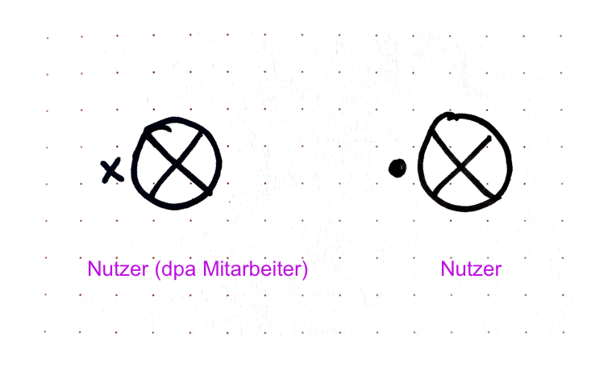
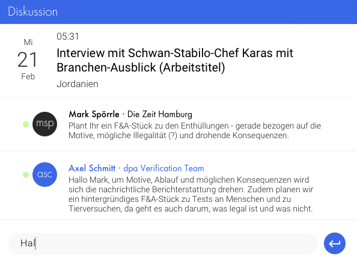

# Nutzer / User

Der Nutzer ist eine Person, die  dpa- und Fremdtools nutzt. Der Nutzer ist Marktplatz-Teilnehmer.

#### tags:
- Akteur
- dpa
	
#### Synonym:
- Kundin
- User
- Akteur

## Beschreibung

Der Nutzer ist ein Medien- oder Kommunikationsprofi mit einer dpa-ID, der ein oder mehrere dpa-Tools oder andere über die dpa-ID erreichbare Tools nutzt.

Der Nutzer verfügt über eine __dpa-ID__, d.h. eine Email und ein Passwort mit der er sich einloggen kann.  Der Nutzer
ist eventuell Teil eines Teams. Der Nutzer hat ein Bild oder eine Repräsentanz mit Kürzel. Der Nutzer hat einen Namen.

Der Nutzer ist in unterschiedlichen Rollen auf dem Marktplatz. Er ist als Person identifizierbar, damit er mit anderen identifizierbaren Personen, also Nutzern in Beziehung treten kann (Kommunizieren, Teilen, Kollaborieren) oder er kann mit Werteinheiten in Beziehung treten (kaufen, zum Kauf anbieten, Planen)

## Skizzen

## Gestaltung

Nutzer ohne Bild im Kontext eines Dialogs

## Ausprägung

- Nutzer ohne Bild
- Nutzer mit Bild
- Liste als select Autocomplete

## Kontext

- bei  Login
- ich selbst eingeloggt
- in Kommunikation
- im Ausweis

## Iterationssrichtung

- Unterscheidung Nutzer nicht dpa / Nutzer dpa-Mitarbeiter
- Nutzer im Zusammenspiel mit Team
- wenn kein Bild da ist, wie wird Nutzer unterscheidbar dargestellt werden

## Ressourcen

- [Sktech-Datei in Abstract](https://share.goabstract.com/dcd88ea2-85bf-4365-b9ff-b44239a9e70b)

## OOUX-Draft

## Kode
[code](/)

## Sketches
[sketches](/)
